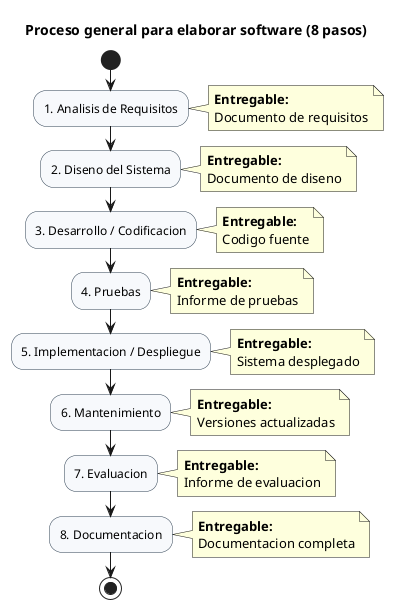
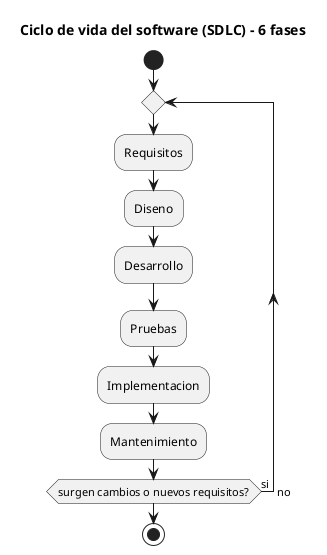
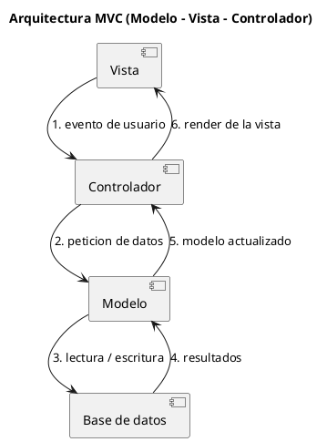
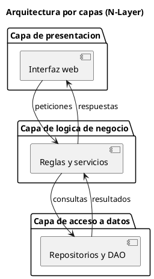
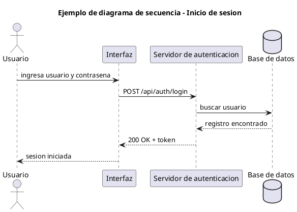
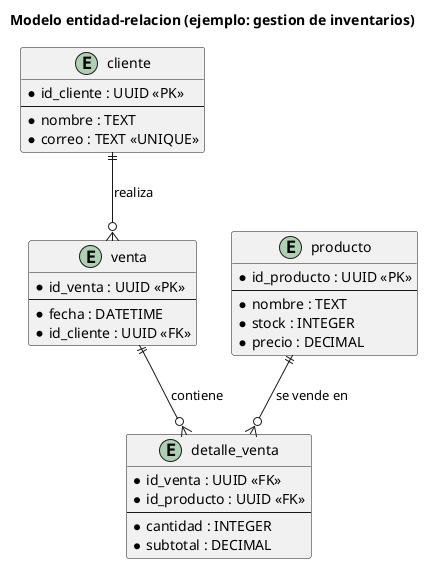
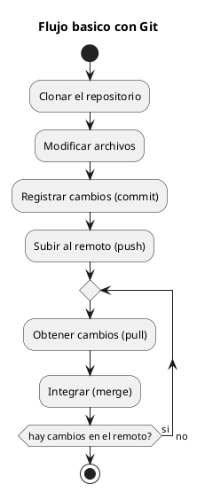
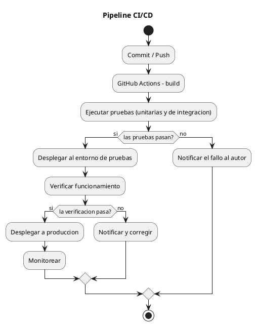

# Fundamentos de Ingeniería de Software - Referencia General

**Proyecto:** Sistema de Gestión Documental con Firma Digital y Trazabilidad (SGD-FD)
**Documento:** referencia teórica de apoyo para la sustentación
**Carpeta:** `00_indice_documentacion/` (portada e índice general)

## 0. Propósito y Alcance

Este documento reúne, en un solo lugar, los conceptos fundamentales que se
aplican a lo largo de todo el proyecto: proceso de desarrollo, requisitos,
ciclo de vida, metodologías, arquitectura, modelado, bases de datos, pruebas,
seguridad, control de versiones, herramientas, despliegue, documentación,
métricas, procedimiento completo, un ejemplo práctico y los errores comunes.

No sustituye a los documentos específicos de cada fase: los **enlaza**. Cada
sección indica al final dónde está la aplicación real de ese concepto dentro
de la documentación y el código del proyecto.

| Criterio | Detalle |
|----------|---------|
| Idioma | Español |
| Codificación | UTF-8 sin BOM |
| Diagramas | Notación PlantUML en bloques ` ```plantuml ` |
| Enlaces | Solo relativos a este documento |
| Verificación de diagramas | Los 8 bloques PlantUML se verifican contra `plantuml.com` y `kroki.io`; el detalle está en [`07_progreso_2_0.md`](07_progreso_2_0.md) |

---

## 0.1. Tabla de Contenido

1. [Proceso general para elaborar software (los 8 pasos)](#1-proceso-general-para-elaborar-software-los-8-pasos)
2. [Tipos de requisitos](#2-tipos-de-requisitos)
3. [Ciclo de vida del software (SDLC)](#3-ciclo-de-vida-del-software-sdlc)
4. [Metodologías de desarrollo](#4-metodologías-de-desarrollo)
5. [Arquitecturas de software](#5-arquitecturas-de-software)
6. [Modelado UML](#6-modelado-uml)
7. [Base de datos](#7-base-de-datos)
8. [Tipos de pruebas](#8-tipos-de-pruebas)
9. [Seguridad del software](#9-seguridad-del-software)
10. [Control de versiones (Git)](#10-control-de-versiones-git)
11. [Herramientas y tecnologías recomendadas](#11-herramientas-y-tecnologías-recomendadas)
12. [Despliegue y DevOps](#12-despliegue-y-devops)
13. [Documentación del software](#13-documentación-del-software)
14. [Métricas del software](#14-métricas-del-software)
15. [Procedimiento completo paso a paso](#15-procedimiento-completo-paso-a-paso-resumen)
16. [Ejemplo práctico en ingeniería de sistemas](#16-ejemplo-práctico-en-ingeniería-de-sistemas)
17. [Errores comunes y cómo evitarlos](#17-errores-comunes-y-cómo-evitarlos)
18. [Mapa de correspondencias y verificación](#18-mapa-de-correspondencias-y-verificación)

---

## 1. Proceso General para Elaborar Software (los 8 Pasos)

Es el flujo secuencial principal: cada paso recibe como entrada el entregable
del paso anterior y produce uno nuevo. En la práctica los pasos se solapan y
retroalimentan, pero el orden fija la **responsabilidad** de cada etapa.

### 1.1. Diagrama del Flujo Secuencial



### 1.2. Detalle de cada Paso

#### Paso 1 - Análisis de Requisitos

| Campo | Contenido |
|-------|-----------|
| Actividades | Identificar necesidades · Recolectar requisitos · Analizar y documentar · Definir alcance |
| Entregable | Documento de requisitos |
| Pregunta clave | **¿Qué** debe hacer el sistema y con qué restricciones? |

#### Paso 2 - Diseño del Sistema

| Campo | Contenido |
|-------|-----------|
| Actividades | Diseñar arquitectura · Modelar datos · Diseñar interfaces · Definir componentes |
| Entregable | Documento de diseño |
| Pregunta clave | **¿Cómo** se va a construir? |

#### Paso 3 - Desarrollo / Codificación

| Campo | Contenido |
|-------|-----------|
| Actividades | Programar módulos · Seguir estándares · Control de versiones · Revisión de código |
| Entregable | Código fuente |
| Pregunta clave | ¿El código refleja lo decidido en el diseño? |

#### Paso 4 - Pruebas

| Campo | Contenido |
|-------|-----------|
| Actividades | Pruebas unitarias · Pruebas de integración · Pruebas del sistema · Pruebas de aceptación |
| Entregable | Informe de pruebas |
| Pregunta clave | ¿Funciona como se pidió, dentro de los criterios de salida? |

#### Paso 5 - Implementación / Despliegue

| Campo | Contenido |
|-------|-----------|
| Actividades | Preparar entorno · Desplegar sistema · Migrar datos · Verificar funcionamiento |
| Entregable | Sistema desplegado |
| Pregunta clave | ¿Corre en el entorno real y con datos reales? |

#### Paso 6 - Mantenimiento

| Campo | Contenido |
|-------|-----------|
| Actividades | Corrección de errores · Mejoras del sistema · Adaptaciones · Soporte técnico |
| Entregable | Versiones actualizadas |
| Pregunta clave | ¿Se sostiene en el tiempo sin degradarse? |

#### Paso 7 - Evaluación

| Campo | Contenido |
|-------|-----------|
| Actividades | Evaluar desempeño · Evaluar satisfacción · Medir calidad · Recoger retroalimentación |
| Entregable | Informe de evaluación |
| Pregunta clave | ¿Se logró lo planeado y con qué calidad? |

#### Paso 8 - Documentación

| Campo | Contenido |
|-------|-----------|
| Actividades | Documentar sistema · Manuales de usuario · Manuales técnicos · Documentar procesos |
| Entregable | Documentación completa |
| Pregunta clave | ¿Otra persona puede operar, mantener y auditar el sistema sin preguntar? |

> **Nota de coherencia:** la documentación no es sólo el paso 8. Se produce de
> forma continua desde el paso 1; el paso 8 garantiza que quede **consolidada
> y actualizada** al cierre.

### 1.3. Aplicación en Este Proyecto

| Paso | Documento del proyecto | Entregable real |
|:----:|------------------------|-----------------|
| 1 | [`requerimientos.md`](../01_planificacion_requerimientos/requerimientos/requerimientos.md), [`casos_uso.md`](../01_planificacion_requerimientos/requerimientos/casos_uso.md) | 27 RF, 44 RNF, 24 CU, 33 US |
| 2 | [`arquitectura.md`](../02_diseno_construccion/arquitectura/arquitectura.md), [`modelo_datos.md`](../02_diseno_construccion/arquitectura/modelo_datos.md) | 3 capas, 5 ADR, esquema de datos |
| 3 | [`desarrollo_codificacion.md`](../03_desarrollo_codificacion/desarrollo_codificacion.md) | Código TypeScript del backend y del frontend |
| 4 | [`metodologia_pruebas.md`](../01_planificacion_requerimientos/metodologia/metodologia_pruebas.md), [`matriz_pruebas.md`](../02_diseno_construccion/pruebas_calidad/matriz_pruebas.md) | 98 pruebas backend + 22 frontend |
| 5 | [`implementacion_despliegue.md`](../04_implementacion_despliegue/implementacion_despliegue.md), [`plan_nube_vercel_supabase.md`](../04_implementacion_despliegue/plan_nube_vercel_supabase.md) | Puesta en marcha local verificada; **nube no ejecutada** |
| 6 | [`07_progreso_2_0.md`](07_progreso_2_0.md), [`guia_tecnica.md`](../05_mantenimiento_evaluacion/operacion/guia_tecnica.md) | Bitácora de correcciones y guía de mantenimiento |
| 7 | [`evaluacion.md`](../05_mantenimiento_evaluacion/evaluacion.md), [`metricas_calidad.md`](../02_diseno_construccion/pruebas_calidad/metricas_calidad.md) | Informe de evaluación y métricas medidas |
| 8 | `doc/` completo (62 documentos) | Índice, manuales, diagramas y plan de nube |

---

## 2. Tipos de Requisitos

### 2.1. Requisitos Funcionales

**Definición:** describen **lo que el sistema debe hacer**. Son verificables
sí/no: o cumple la función o no la cumple.

| # | Ejemplo genérico |
|:-:|------------------|
| 1 | Registrar usuarios |
| 2 | Generar reportes de ventas |
| 3 | Realizar inicio de sesión |
| 4 | Buscar productos |
| 5 | Gestionar inventario |

**Cómo se redactan:** acción + objeto + condición + criterio de aceptación.
Ejemplo: *"El sistema debe permitir registrar un producto con nombre, categoría
y stock inicial, validando que el nombre no esté duplicado."*

**Identificadores:** en este proyecto se usan `RF-###` y se catalogan en
[`requerimientos.md`](../01_planificacion_requerimientos/requerimientos/requerimientos.md)
(27 RF).

### 2.2. Requisitos No Funcionales

**Definición:** describen **cómo debe funcionar el sistema**: calidad,
restricciones y atributos de la arquitectura. No añaden funciones; condicionan
todas las demás.

| # | Ejemplo genérico | Atributo |
|:-:|------------------|----------|
| 1 | El sistema debe responder en menos de 2 segundos | Rendimiento |
| 2 | El sistema debe ser seguro y proteger los datos | Seguridad |
| 3 | El sistema debe estar disponible 24/7 | Disponibilidad |
| 4 | El sistema debe ser escalable | Escalabilidad |

**Cuidado con la verificabilidad:** un RNF sin forma de medirlo es una
aspiración, no un requisito. Se corrige añadiendo método y meta:
*"responder en menos de 2 s"* → medido en el 95.º percentil del endpoint.

**Identificadores:** `RNF-###`, catálogo en el mismo
[`requerimientos.md`](../01_planificacion_requerimientos/requerimientos/requerimientos.md)
(44 RNF).

### 2.3. Diferencia esencial

| Criterio | Funcional | No funcional |
|----------|-----------|--------------|
| Responde a | **Qué** hace | **Cómo** lo hace |
| Ejemplo | Firmar un documento | La firma se calcula en menos de 2 s |
| Falla visible como | Función ausente o errónea | Sistema lento, inseguro o inestable |
| Prioridad típica | Se negocia | Suele ser restricción fija |
| Rastreo en este proyecto | Casos de uso `CU-###` | Matriz de trazabilidad RF ↔ prueba |

---

## 3. Ciclo de Vida del Software (SDLC)

El SDLC (*Software Development Life Cycle*) organiza el trabajo en **6 fases**
repetibles. A diferencia de la lista lineal de 8 pasos, el SDLC enfatiza que
**no termina**: lo que se detecta en mantenimiento vuelve a alimentar los
requisitos.

### 3.1. Las 6 Fases

| # | Fase | Entrada | Salida |
|:-:|------|---------|--------|
| 1 | Requisitos | Necesidades del usuario | Requerimientos aprobados |
| 2 | Diseño | Requerimientos | Arquitectura y modelo de datos |
| 3 | Desarrollo | Diseño | Código funcional |
| 4 | Pruebas | Código | Pruebas superadas y defectos cerrados |
| 5 | Implementación | Sistema probado | Sistema en producción |
| 6 | Mantenimiento | Sistema en producción | Mejoras y correcciones, y de vuelta a la fase 1 |

### 3.2. Diagrama Circular



### 3.3. Relación entre los 8 Pasos y las 6 Fases

| Pasos del §1 | Fase SDLC |
|--------------|-----------|
| 1 Análisis de requisitos | Requisitos |
| 2 Diseño del sistema | Diseño |
| 3 Desarrollo / codificación | Desarrollo |
| 4 Pruebas | Pruebas |
| 5 Implementación / despliegue | Implementación |
| 6 Mantenimiento | Mantenimiento |
| 7 Evaluación | Cruce: alimenta Requisitos y Mantenimiento |
| 8 Documentación | Cruce: acompaña todas las fases |

Los 8 pasos separan **mantener de evaluar y documentar**, que en el SDLC de 6
fases quedan implícitos. Usar los 8 cuando se rinde cuentas por entregables y
las 6 cuando se gestiona el ciclo largo del producto.

---

## 4. Metodologías de Desarrollo

### 4.1. Tabla Comparativa

| Metodología | Característica principal | Cuándo se usa |
|-------------|--------------------------|---------------|
| **Cascada** | Secuencial: cada fase debe terminar para iniciar otra | Proyectos pequeños, requisitos estables y bien conocidos |
| **Iterativa** | Desarrollo por iteraciones e incrementos sucesivos | Requisitos cambiantes o poco definidos al inicio |
| **Incremental** | Entregas parciales con valor agregado en cada versión | Cuando se necesita entregar valor temprano y de forma rápida |
| **Ágil (Scrum)** | Iteraciones cortas (*sprints*), colaboración continua y revisión al cierre de cada sprint | Proyectos dinámicos con equipos colaborativos |

### 4.2. Dimensiones de Comparación

| Dimensión | Cascada | Iterativa | Incremental | Ágil (Scrum) |
|-----------|---------|-----------|-------------|--------------|
| Orden del trabajo | Lineal, estricto | Cíclico por iteración | Por incrementos funcionales | Por sprint (1-4 semanas) |
| Requisitos | Congelados al inicio | Se revisan cada iteración | Se detallan por incremento | Se refinan continuamente |
| Entrega al cliente | Al final del proyecto | Al cierre de cada iteración | Por incremento usable | Al cierre de cada sprint |
| Respuesta al cambio | Baja (caro cambiar) | Media | Media-alta | Alta |
| Documentación | Muy pesada | Proporcional al avance | Por incremento | Justo lo necesario |
| Riesgo principal | Sorpresa tardía | Iterar sin dirección clara | Integración acumulada | Dependencia del equipo |

### 4.3. Metodología Aplicada en Este Proyecto

El proyecto usa un modelo **por fases con verificación**, documentado en
[`metodologia_general.md`](../01_planificacion_requerimientos/metodologia/metodologia_general.md):

| Rasgo | Implementación |
|-------|----------------|
| Secuencia por fases | 6 fases de la tesis, cada una con productos de salida verificables |
| Iteración real | La fase 6 y la bitácora de progreso registran rondas de corrección sobre fases anteriores |
| Incremento | Avance por módulos (usuarios, documentos, versiones, verificación) con pruebas en cada incremento |
| TDD / BDD | Ado­ptados como técnicas dentro de la fase de diseño y pruebas; ver [`enfoque_tdd.md`](../02_diseno_construccion/pruebas_calidad/enfoque_tdd.md) y [`enfoque_bdd.md`](../02_diseno_construccion/pruebas_calidad/enfoque_bdd.md) |
| Definición de "terminado" | Sección *Definition of Done* de [`metodologia_general.md`](../01_planificacion_requerimientos/metodologia/metodologia_general.md) |

---

## 5. Arquitecturas de Software

### 5.1. Cuatro Arquitecturas Frecuentes

| Arquitectura | Descripción | Uso típico |
|--------------|-------------|------------|
| **Cliente-Servidor** | Los clientes solicitan servicios a un servidor central | Sistemas web: un navegador (cliente) contra una API (servidor) |
| **MVC (Modelo-Vista-Controlador)** | Separa lógica de negocio, datos e interfaz | Muy usada en aplicaciones web con servidor |
| **Capas (N-Layer)** | Organiza el código en capas: presentación, negocio, datos, etc. | Aplicaciones que necesitan sustituir una capa sin tocar las demás |
| **Microservicios** | El sistema se divide en servicios pequeños e independientes | Equipos grandes y productos con escalado diferenciado |

### 5.2. Cliente-Servidor

```
[Cliente: navegador / app]  ---- HTTP/HTTPS ---->  [Servidor: API]
        (interfaz)                                   (lógica + datos)
```

- El cliente **no** confía en sí mismo: la validación de negocio vive en el servidor.
- El servidor es el único punto de acceso a la base de datos.
- **En este proyecto:** frontend SvelteKit (cliente) contra API Express (servidor); ver [`arquitectura.md`](../02_diseno_construccion/arquitectura/arquitectura.md).

### 5.3. MVC



| Pieza | Responsabilidad | No debe |
|-------|-----------------|---------|
| **Vista** | Presentar datos y capturar eventos | Contener reglas de negocio ni consultas SQL |
| **Controlador** | Recibir la petición, coordinar y elegir la vista | Persistir datos directamente |
| **Modelo** | Reglas de negocio y acceso a datos | Conocer cómo se dibuja la interfaz |

### 5.4. Arquitectura por Capas (N-Layer)



**Regla de dependencia:** una capa sólo puede llamar a la de **debajo**, nunca
saltar. La interfaz no habla con la base de datos: pasa por el negocio.

**En este proyecto:** la capa 1 es `frontend/`, la capa 2 son
`backend/src/services/` y `backend/src/routes/`, y la capa 3 es
`backend/src/db/`. La decisión de mantener un **monolito modular** en lugar de
microservicios está registrada en el ADR-004 de
[`arquitectura.md`](../02_diseno_construccion/arquitectura/arquitectura.md).

---

## 6. Modelado UML

### 6.1. Los 4 Diagramas Más Usados

| Diagrama | Tipo | Qué muestra | Cuándo se usa |
|----------|------|-------------|---------------|
| **Casos de uso** | Comportamiento | Las funcionalidades del sistema y los actores que las usan | Para acordar el alcance con el cliente |
| **Clases** | Estructural | La estructura del sistema: clases, atributos, métodos y relaciones | Para diseñar el modelo de datos y los módulos |
| **Secuencia** | Comportamiento | La interacción entre objetos ordenada en el tiempo | Para explicar un flujo concreto con varios participantes |
| **Actividades** | Comportamiento | El flujo de procesos, con decisiones y paralelismos | Para describir un procedimiento de negocio paso a paso |

### 6.2. Ejemplo Notacional - Diagrama de Secuencia



Lectura: cada flecha es un mensaje; el tiempo baja de arriba hacia abajo;
las flechas `-->` (devolución) son respuestas a las anteriores.

### 6.3. Diagramas del Proyecto

El proyecto ya tiene los 8 diagramas documentados y verificados; esta sección
sólo aporta la notación:

| Diagrama | Documento |
|----------|-----------|
| Casos de uso | [`diagrama_casos_uso.md`](../06_diagramas_y_software/diagrama_casos_uso.md) (24 casos de uso por actor) |
| Clases | [`diagrama_clases.md`](../06_diagramas_y_software/diagrama_clases.md) |
| Secuencia | [`diagrama_secuencia.md`](../06_diagramas_y_software/diagrama_secuencia.md) |
| Actividades | [`diagrama_actividades.md`](../06_diagramas_y_software/diagrama_actividades.md) (6 flujos) |
| Estados | [`diagrama_estados.md`](../06_diagramas_y_software/diagrama_estados.md) (6 máquinas de estado) |
| Componentes | [`diagrama_componentes.md`](../06_diagramas_y_software/diagrama_componentes.md) |
| Paquetes | [`diagrama_paquetes.md`](../06_diagramas_y_software/diagrama_paquetes.md) |
| Despliegue | [`diagrama_despliegue.md`](../06_diagramas_y_software/diagrama_despliegue.md) |

---

## 7. Base de Datos

### 7.1. Modelo E-R

**Definición:** diseño **conceptual** de la base de datos antes de traducirla
a tablas: entidades, atributos y relaciones. Responde a *qué información
existe*, no a *cómo se guarda*.



| Símbolo | Significado |
|---------|-------------|
| `*` | Atributo obligatorio (notación Chen/PN) |
| `<<PK>>` | Llave primaria |
| `<<FK>>` | Llave foránea (referencia a otra entidad) |
| `||--o{` | Un cliente realiza cero o muchas ventas |

### 7.2. Tablas

Las tablas son la traducción física de las entidades. Cada fila es un registro;
cada columna, un atributo con tipo y restricciones.

| Tabla | Propósito | Ejemplo de columnas |
|-------|-----------|---------------------|
| `usuarios` | Quién puede entrar y qué puede hacer | `id_usuario`, `correo`, `hash_contrasena`, `rol` |
| `productos` | Catálogo de bienes (ejemplo genérico) | `id_producto`, `nombre`, `stock`, `precio` |
| `ventas` | Operaciones realizadas (ejemplo genérico) | `id_venta`, `fecha`, `id_cliente` |

### 7.3. Llaves Primarias

**Definición:** identifican de forma **única** cada registro; no pueden repetirse
ni ser nulas.

| Bueno | Malo |
|-------|------|
| `id_usuario` = `3f9a…` (UUID) o `1`, `2`, `3` (entero correlativo) | Usar el correo como llave (cambia y tiene acentos/mayúsculas) |
| Una sola llave por tabla | Dos columnas candidatas sin definir cuál manda |

**Ejemplo:** `id_usuario`. **En este proyecto:** se usan UUID (`uuid` en
backend) como llaves y el correo tiene restricción `UNIQUE`.

### 7.4. Relaciones

Conectan tablas entre sí mediante llaves foráneas.

| Cardinalidad | Significado | Ejemplo |
|--------------|-------------|---------|
| `1 a 1` | Un registro se asocia a uno solo | usuario ↔ perfil |
| `1 a N` | Un registro se asocia a varios | cliente → ventas |
| `N a M` | Varios con varios, se resuelve con tabla puente | productos ↔ ventas mediante `detalle_venta` |

**Ejemplo:** `ventas → clientes`.

### 7.5. Integridad

| Tipo | Qué garantiza | Mecanismo |
|------|---------------|-----------|
| **Integridad de entidad** | Toda fila tiene su llave primaria | `PRIMARY KEY`, `NOT NULL` |
| **Integridad referencial** | No existen huérfanos entre tablas | `FOREIGN KEY` + `ON DELETE` |
| **Integridad de dominio** | Los valores tienen tipo y rango válidos | `CHECK`, tipos, `UNIQUE` |
| **Integridad de usuario** | Reglas del negocio se cumplen | Validación en la capa de servicio |

> Sólo los tres primeros se declaran en la base de datos; el cuarto vive en la
> capa de lógica de negocio. Dejarlo sólo en la base de datos es un error
> frecuente.

### 7.6. Base de Datos de Este Proyecto

| Aspecto | Decisión |
|---------|----------|
| Motor | SQLite embebido vía `sql.js` en memoria, con persistencia explícita (ADR-005) |
| Esquema | Documentado en [`modelo_datos.md`](../02_diseno_construccion/arquitectura/modelo_datos.md) |
| Diagrama estructural | [`diagrama_clases.md`](../06_diagramas_y_software/diagrama_clases.md) |
| Restricción conocida | `DbDriver` es síncrona: impide migrar a PostgreSQL sin rediseño |

---

## 8. Tipos de Pruebas

### 8.1. Los Cuatro Niveles

| Nivel | Alcance | Quién lo ejecuta | Pregunta que responde |
|-------|---------|------------------|-----------------------|
| **Pruebas unitarias** | Cada módulo o función individualmente | Desarrollador | ¿Esta pieza aislada hace lo que debe? |
| **Pruebas de integración** | La interacción entre módulos | Desarrollador / QA técnico | ¿Los módulos conversan bien entre sí? |
| **Pruebas del sistema** | El sistema completo como un todo | QA | ¿El producto entero cumple los requisitos? |
| **Pruebas de aceptación (UAT)** | Validación final por el usuario | Usuario o cliente | ¿El sistema resuelve el problema real? |

### 8.2. Pirámide de Pruebas

```
              /  UAT  \            pocos, caros, cerca del usuario
             /---------\
           /  Sistema    \         pocos, con datos realistas
          /---------------\
        /  Integración     \      medios
       /---------------------\
      /      Unitarias        \   muchos, rápidos, baratos
     /-------------------------\
```

**Regla práctica:** cuanto más arriba, menos pruebas y más costo por caso;
cuanto más abajo, más pruebas y más velocidad. Invertir la pirámide (sólo
pruebas manuales de extremo a extremo) produce ciclos lentos y feedback tardío.

### 8.3. Criterios de Entrada y Salida

| Criterio | Ejemplo |
|----------|---------|
| Entrada | Ambiente desplegado, datos de prueba cargados, pruebas aprobadas en revisión |
| Salida | 100 % de pruebas ejecutadas, sin defectos de severidad alta abiertos, informe emitido |

### 8.4. Pruebas en Este Proyecto

| Nivel | Implementación | Resultado |
|-------|----------------|-----------|
| Unitarias | `vitest` en backend (`src/**/*.test.ts`) | Incluidas en las 98 pruebas backend |
| Integración | `supertest` contra la API Express con base aislada | Incluidas en las 98 pruebas backend |
| Sistema (API HTTP) | Escenarios HTTP completos con autenticación | 98/98 |
| Cliente | `vitest` + `@testing-library/svelte` en frontend | 22/22 |
| Aceptación | Escenarios multiusuario documentados | Registrados en [`metodologia_pruebas.md`](../01_planificacion_requerimientos/metodologia/metodologia_pruebas.md) |

Marco normativo completo: ISO/IEC/IEEE 29119 en
[`aplicacion_iso_29119.md`](../02_diseno_construccion/pruebas_calidad/aplicacion_iso_29119.md);
plan y matrices en
[`plan_de_pruebas.md`](../02_diseno_construccion/pruebas_calidad/plan_de_pruebas.md)
y [`matriz_pruebas.md`](../02_diseno_construccion/pruebas_calidad/matriz_pruebas.md).

---

## 9. Seguridad del Software

### 9.1. Controles Fundamentales

| Control | Defecto que previene | Ejemplo concreto |
|---------|----------------------|------------------|
| **Autenticación** | Alguien entra haciéndose pasar por otro | Login con usuario y contraseña + JWT firmado |
| **Autorización** | Un usuario usa funciones que no le corresponden | Rol `admin` vs. `usuario`; verificación de propiedad del documento |
| **Cifrado** | Robo o lectura de datos sensibles | Clave privada cifrada; SHA-256 del contenido y firma RSA-SHA256 |
| **Control de acceso** | Escalada de privilegios | Roles y privilegios explícitos por recurso |
| **Respaldo de datos** | Pérdida irreversible | Copias periódicas de la base y de los archivos |
| **Validación de entradas** | Inyecciones (SQL, XSS, path traversal) | Validación en la capa de servicio y encapsulamiento del acceso a datos |
| **Auditoría y monitoreo** | Nadie sabe quién hizo qué | Bitácora de eventos con encadenado por hash |

### 9.2. Orden de Implementación Recomendado

1. **Autenticar** antes de cualquier operación.
2. **Autorizar** cada recurso, no sólo cada ruta.
3. **Validar** toda entrada de usuario en el servidor.
4. **Cifrar** en reposo lo sensible y en tránsito todo (HTTPS).
5. **Registrar** cada operación relevante.
6. **Respaldar** con prueba de restauración.
7. **Monitorear** y revisar los registros periódicamente.

### 9.3. Seguridad Implementada y Riesgos Abiertos

| Control | Estado en el proyecto | Documento |
|---------|-----------------------|-----------|
| Autenticación con JWT y contraseña `bcrypt` | Implementado y probado | [`seguridad.md`](../05_mantenimiento_evaluacion/seguridad/seguridad.md) §2.1, §3 |
| Autorización por propietario + roles | Implementado | [`seguridad.md`](../05_mantenimiento_evaluacion/seguridad/seguridad.md) §2.2-2.3 |
| Cabeceras `helmet` y CORS restringido | Implementado | [`seguridad.md`](../05_mantenimiento_evaluacion/seguridad/seguridad.md) §8 |
| Limitador de tasa global y de login | Implementado | [`seguridad.md`](../05_mantenimiento_evaluacion/seguridad/seguridad.md) §7 |
| Bitácora de auditoría encadenada por hash | Implementado | [`seguridad.md`](../05_mantenimiento_evaluacion/seguridad/seguridad.md) §9 |
| OWASP Top 10 (2021) | Mapeado; **riesgos residuales declarados** | [`seguridad.md`](../05_mantenimiento_evaluacion/seguridad/seguridad.md) §5, §11 |
| Auditoría externa / certificación ISO 27001 | **No realizada / no solicitada** | [`aplicacion_iso_27000.md`](../05_mantenimiento_evaluacion/iso_aplicada/aplicacion_iso_27000.md) |
| Firma electrónica certificada (Ley N.° 27269) | **Sin AC acreditada ni TSA** | [`seguridad.md`](../05_mantenimiento_evaluacion/seguridad/seguridad.md) §13 |

---

## 10. Control de Versiones (Git)

### 10.1. Conceptos

| Elemento | Definición |
|----------|------------|
| **Git** | Sistema de control de versiones **distribuido**: cada desarrollador tiene el historial completo local |
| **GitHub / GitLab** | Hospedaje de repositorios en la nube: respaldo, revisión y colaboración |
| **Repositorio** | Conjunto de archivos + todo su historial |
| **Commit** | Instantánea del proyecto con mensaje que explica el porqué |
| **Rama** | Línea de desarrollo independiente que se integra luego |

### 10.2. Flujo Básico



### 10.3. Comandos de Uso Diario

| Acción | Comando |
|--------|---------|
| Clonar | `git clone <url>` |
| Ver estado | `git status` |
| Preparar cambios | `git add <archivo>` |
| Guardar cambios | `git commit -m "mensaje"` |
| Subir | `git push` |
| Bajar e integrar | `git pull` |
| Ver historial | `git log --oneline -10` |
| Ramas | `git branch <nombre>` / `git checkout -b <nombre>` |

### 10.4. Beneficios

| Beneficio | Aporte concreto |
|-----------|-----------------|
| **Historial** | Se sabe quién cambió qué, cuándo y por qué |
| **Trabajo en equipo** | Las ramas permiten avanzar en paralelo sin pisarse |
| **Respaldo** | El remoto es una copia del historial completo |
| **Trazabilidad** | Cada commit puede ligarse a un requisito o una corrección |
| **Reversión** | Se puede deshacer un cambio sin arrastrar el resto |

### 10.5. Estrategia de Commits en Este Proyecto

| Convención | Detalle |
|------------|---------|
| Repositorio | `JoshuaJBLX/TESIS2`, rama principal `main` |
| Mensajes | Formato convencional (`feat:`, `fix:`, `docs:`, `chore:`) |
| Etapa de definición | Estrategia de commits en [`metodologia_general.md`](../01_planificacion_requerimientos/metodologia/metodologia_general.md) §5 |
| Revisión previa | `git status` + `git diff` antes de confirmar; se versiona sólo lo intencional |
| Línea | `.gitattributes` fija fin de línea `LF` para todos los textos |

---

## 11. Herramientas y Tecnologías Recomendadas

### 11.1. Catálogo General por Categoría

| Categoría | Opciones frecuentes | Para qué sirven |
|-----------|---------------------|-----------------|
| **Lenguajes** | HTML, PHP, Python, JavaScript, Java | Escribir el código |
| **Frameworks** | Laravel, Django, Spring Boot, .NET | Estructura, seguridad y herramientas ya resueltas |
| **Bases de datos** | MySQL, PostgreSQL, SQL Server, MongoDB | Persistencia relacional o documental |
| **Front-end** | HTML/CSS, React, Vue.js, Bootstrap | Interfaz en el navegador |
| **Herramientas** | VS Code, Figma, Postman, Draw.io | Editor, diseño, prueba de APIs y diagramas |

### 11.2. Qué Elegir: Criterios, no Modas

| Criterio | Pregunta |
|----------|----------|
| Madurez | ¿Tiene comunidad activa y documentación confiable? |
| Alineación con el equipo | ¿El equipo ya lo conoce o hay tiempo de aprenderlo? |
| Requisitos del producto | ¿Necesita transacciones fuertes, tiempo real, móvil? |
| Costo total | ¿Licencia, hospedaje, mantenimiento y curva de aprendizaje? |
| Mantenibilidad | ¿Habrá desarrolladores disponibles en 3 años? |

### 11.3. Stack Elegido en Este Proyecto

| Capa | Elección | Motivo |
|------|----------|--------|
| Lenguaje | TypeScript (backend y frontend) | Un solo lenguaje en todo el sistema |
| Backend | Express 4 + `tsx` | Ligero, ampliamente documentado |
| Base de datos | SQLite vía `sql.js` | Cero instalación; decisión registrada (ADR-005) |
| Frontend | SvelteKit 2 + Svelte 5 + Vite | SSR opcional, rendimiento y reactividad por runes |
| Pruebas | Vitest + Supertest | Mismo runner en backend y frontend |
| Seguridad | `bcryptjs`, `jsonwebtoken`, `helmet` | Estándares de la comunidad, sin criptografía casera |
| Edición / diseño / pruebas / diagramas | VS Code, Figma, Postman, Draw.io | Las 4 herramientas del catálogo |
| Inventario completo de dependencias | 32 paquetes con licencias y riesgos | [`software_utilizado.md`](../06_diagramas_y_software/software_utilizado.md) |

---

## 12. Despliegue y DevOps

**DevOps** permite automatizar y facilitar la entrega del software: integración
continua (CI) = integrar y probar cada cambio automáticamente; entrega continua
(CD) = dejar ese cambio listo para producción con el menor esfuerzo posible.

### 12.1. Componentes

| Componente | Función |
|------------|---------|
| **Docker** | Contenedores que empaquetan la aplicación con sus dependencias, igual en desarrollo y producción |
| **GitHub Actions** | Automatizar pruebas e integración continua (CI/CD) en cada *push* |
| **AWS / Azure / GCP** | Despliegue en la nube, con escalado y respaldo |
| **Nginx / Apache** | Servidores web: reciben el tráfico HTTP y lo enrutan |
| **Linux Server** | Entorno de producción estable y reproducible |

### 12.2. Pipeline de Entrega



### 12.3. Estado del Despliegue en Este Proyecto

| Aspecto | Estado | Documento |
|---------|--------|-----------|
| Puesta en marcha local | **Verificada** (backend :3000, frontend :5173) | [`implementacion_despliegue.md`](../04_implementacion_despliegue/implementacion_despliegue.md) |
| Despliegue en nube | **No ejecutado** | [`plan_nube_vercel_supabase.md`](../04_implementacion_despliegue/plan_nube_vercel_supabase.md) |
| Objetivo previsto | Vercel (frontend) + Supabase (base de datos) | Mismo documento |
| Bloqueos declarados | `DbDriver` síncrona; `uploads/` en sistema de archivos efímero; sólo `adapter-auto` | [`07_progreso_2_0.md`](07_progreso_2_0.md), [`arquitectura.md`](../02_diseno_construccion/arquitectura/arquitectura.md) §7 |
| CI/CD automatizado | **No configurado** | Pendiente en [`roadmap_produccion.md`](../05_mantenimiento_evaluacion/operacion/roadmap_produccion.md) |
| Guía de despliegue en producción | Redactada, **sin ejecutar** | [`guia_despliegue_produccion.md`](../05_mantenimiento_evaluacion/operacion/guia_despliegue_produccion.md) |

---

## 13. Documentación del Software

### 13.1. Tipos de Documento

| Documento | Qué define | Público |
|-----------|------------|---------|
| **Documento de Requisitos (SRS)** | Qué debe hacer el sistema | Cliente, equipo, auditor |
| **Diseño Técnico** | La arquitectura y las decisiones de diseño | Desarrolladores |
| **Manual de Usuario** | Cómo operar el sistema | Usuario final |
| **Manual Técnico** | Instalación, mantenimiento y soporte | Administrador y mantenedor |
| **Casos de Prueba** | Escenarios para validar funcionalidades | QA y revisores |

### 13.2. Dónde Está Cada Uno Aquí

| Tipo | Documento del proyecto |
|------|------------------------|
| SRS | [`requerimientos.md`](../01_planificacion_requerimientos/requerimientos/requerimientos.md) (27 RF, 44 RNF) + [`funcionalidades.md`](../01_planificacion_requerimientos/requerimientos/funcionalidades.md) |
| Casos de uso / historias | [`casos_uso.md`](../01_planificacion_requerimientos/requerimientos/casos_uso.md) (24 CU), [`historias_usuario.md`](../01_planificacion_requerimientos/requerimientos/historias_usuario.md) (33 US) |
| Diseño técnico | [`arquitectura.md`](../02_diseno_construccion/arquitectura/arquitectura.md), [`modelo_datos.md`](../02_diseno_construccion/arquitectura/modelo_datos.md), [`desarrollo_codificacion.md`](../03_desarrollo_codificacion/desarrollo_codificacion.md) |
| Manual de usuario | [`manual_usuario.md`](../05_mantenimiento_evaluacion/operacion/manual_usuario.md) |
| Manual técnico | [`guia_tecnica.md`](../05_mantenimiento_evaluacion/operacion/guia_tecnica.md), [`guia_despliegue_produccion.md`](../05_mantenimiento_evaluacion/operacion/guia_despliegue_produccion.md) |
| Casos de prueba | [`plan_de_pruebas.md`](../02_diseno_construccion/pruebas_calidad/plan_de_pruebas.md), [`matriz_pruebas.md`](../02_diseno_construccion/pruebas_calidad/matriz_pruebas.md) |
| Trazabilidad | [`matriz_trazabilidad.md`](../02_diseno_construccion/pruebas_calidad/matriz_trazabilidad.md) |
| Punto de entrada | [`00_indice_documentacion.md`](00_indice_documentacion.md) |

---

## 14. Métricas del Software

### 14.1. Métricas Frecuentes

| Métrica | Qué mide | Ejemplo de meta |
|---------|----------|-----------------|
| **Tiempo de respuesta** | Tiempo en responder una solicitud | Menos de 2 segundos |
| **Tasa de errores (bugs)** | Cantidad de errores por módulo | 3 bugs encontrados en el módulo X |
| **Disponibilidad** | Porcentaje de tiempo disponible | 99.9 % |
| **Satisfacción del usuario** | Nivel de satisfacción | 90 % según encuestas |
| **Cobertura de pruebas** | Porcentaje del código probado | 80 % |

### 14.2. Reglas para que una Métrica Sirva

| Regla | Explicación |
|-------|-------------|
| **Comparar contra una meta** | Un número solo no dice nada: 1.8 s es bueno o malo según el objetivo |
| **Definir la fuente** | De dónde sale el dato: logs, encuesta, reporte del runner de pruebas |
| **Frecuencia de medición** | ¿Se mide una vez o en cada entrega? |
| **Acción asociada** | Si se incumple, ¿qué se hace? |

### 14.3. Métricas Medidas en Este Proyecto

| Métrica | Valor obtenido | Fuente |
|---------|----------------|--------|
| Tasa de pruebas satisfactorias | 120/120 (98 backend + 22 frontend) | [`metricas_calidad.md`](../02_diseno_construccion/pruebas_calidad/metricas_calidad.md) §3.1 |
| Trazabilidad RF ↔ prueba | 100 % | [`matriz_trazabilidad.md`](../02_diseno_construccion/pruebas_calidad/matriz_trazabilidad.md) |
| Cobertura funcional de la interfaz | 43 % (3 de 7 áreas) | [`evaluacion.md`](../05_mantenimiento_evaluacion/evaluacion.md) §10.1 |
| Verificación de tipos | `tsc --noEmit` 0 errores; `svelte-check` 0/0 | [`00_indice_documentacion.md`](00_indice_documentacion.md) §7.1 |
| Enlaces documentales rotos | 0 de 578 | [`00_indice_documentacion.md`](00_indice_documentacion.md) §7.1 |
| Diagramas PlantUML que renderizan | 34/34 en `plantuml.com` y `kroki.io` | [`07_progreso_2_0.md`](07_progreso_2_0.md) §12 |
| Disponibilidad y tiempo de respuesta reales | **No medidos** (nunca hubo producción) | [`evaluacion.md`](../05_mantenimiento_evaluacion/evaluacion.md) §7.2 |
| Satisfacción de usuario | **No medida** (sin usuarios reales) | [`evaluacion.md`](../05_mantenimiento_evaluacion/evaluacion.md) §7.2 |

---

## 15. Procedimiento Completo Paso a Paso (Resumen)

### 15.1. Los 12 Pasos

| # | Paso | Fase SDLC | Producto |
|:-:|------|-----------|----------|
| 1 | Identificar el problema y los objetivos del sistema | Requisitos | Alcance y objetivos |
| 2 | Recolectar y analizar los requisitos con los usuarios | Requisitos | Requisitos analizados |
| 3 | Definir el alcance y documentar los requisitos | Requisitos | Documento de requisitos |
| 4 | Diseñar la arquitectura y las interfaces del sistema | Diseño | Documento de diseño |
| 5 | Seleccionar tecnologías y herramientas adecuadas | Diseño | Stack decidido y justificado |
| 6 | Desarrollar los módulos según el diseño | Desarrollo | Código fuente |
| 7 | Realizar pruebas (unitarias, integración, sistema, aceptación) | Pruebas | Informe de pruebas |
| 8 | Implementar el sistema en el entorno de producción | Implementación | Sistema desplegado |
| 9 | Capacitar a los usuarios y entregar el sistema | Implementación | Usuarios capacitados |
| 10 | Monitorear el sistema y corregir errores | Mantenimiento | Incidencias resueltas |
| 11 | Mantener y mejorar el sistema continuamente | Mantenimiento | Versiones actualizadas |
| 12 | Documentar todo el proceso y los resultados | Todas | Documentación completa |

### 15.2. Cómo Usar Esta Lista

- Los pasos **1-3** responden al *qué*.
- Los pasos **4-5** responden al *cómo*.
- El paso **6** es construcción; el **7** es verificación.
- Los pasos **8-9** son puesta en marcha y transferencia.
- Los pasos **10-11** sostienen el producto en el tiempo.
- El paso **12** es transversal: se hace desde el inicio y se cierra al final.

---

## 16. Ejemplo Práctico en Ingeniería de Sistemas

### 16.1. Sistema Web de Gestión de Inventarios

| Fase | Qué se hace en este ejemplo |
|------|------------------------------|
| **Requisitos** | Registrar productos, entradas, salidas y reportes; control de stock |
| **Diseño** | Arquitectura MVC, base de datos, interfaces web |
| **Desarrollo** | Módulos: usuarios, productos, proveedores, ventas, reportes |
| **Pruebas** | Pruebas unitarias, de integración y de aceptación |
| **Implementación** | Se despliega en un servidor web (AWS) |
| **Mantenimiento** | Corrección de errores, mejoras y nuevas funcionalidades |

El modelo E-R del §7.1 corresponde a este ejemplo.

### 16.2. Contraparte Real: SGD-FD

| Fase | Ejemplo genérico | Implementado en el SGD-FD |
|------|------------------|---------------------------|
| Requisitos | Productos, entradas, salidas, reportes | Alta y consulta de documentos, versionado, firma digital, verificación pública, auditoría |
| Diseño | MVC + base de datos + interfaces | 3 capas (presentación / lógica / datos) + bitácora encadenada por hash |
| Desarrollo | Usuarios, productos, proveedores, ventas, reportes | Usuarios y sesiones, documentos y versiones, firmas, verificación, auditoría y reportes |
| Pruebas | Unitarias, integración, aceptación | 98 backend + 22 frontend, matrices y TDD/BDD |
| Implementación | Servidor web (AWS) | Local verificada (Node :3000 + Vite :5173); **nube prevista en Vercel + Supabase, no ejecutada** |
| Mantenimiento | Correcciones y mejoras | Bitácora de progreso con defectos detectados y corregidos |

---

## 17. Errores Comunes y Cómo Evitarlos

| # | Error común | Cómo evitarlo | Dónde se respalda en este proyecto |
|:-:|-------------|---------------|------------------------------------|
| 1 | Programar sin analizar requisitos | Realizar un buen levantamiento y análisis con los usuarios | [`requerimientos.md`](../01_planificacion_requerimientos/requerimientos/requerimientos.md), [`casos_uso.md`](../01_planificacion_requerimientos/requerimientos/casos_uso.md) |
| 2 | No documentar el sistema | Documentar desde el inicio hasta el final | [`00_indice_documentacion.md`](00_indice_documentacion.md) (62 documentos, enlaces auditados) |
| 3 | No realizar pruebas suficientes | Aplicar pruebas en todas las etapas | [`metodologia_pruebas.md`](../01_planificacion_requerimientos/metodologia/metodologia_pruebas.md) (4 niveles) |
| 4 | No usar control de versiones | Usar Git y repositorios (GitHub/GitLab) | Repositorio `JoshuaJBLX/TESIS2` y estrategia de commits |
| 5 | Ignorar la seguridad | Implementar controles de seguridad | [`seguridad.md`](../05_mantenimiento_evaluacion/seguridad/seguridad.md) (7 controles, riesgos declarados) |
| 6 | No mantener el sistema | Planificar mantenimiento continuo | [`roadmap_produccion.md`](../05_mantenimiento_evaluacion/operacion/roadmap_produccion.md), [`guia_tecnica.md`](../05_mantenimiento_evaluacion/operacion/guia_tecnica.md) |
| 7 | No considerar al usuario final | Involucrar usuarios y validar con ellos | [`manual_usuario.md`](../05_mantenimiento_evaluacion/operacion/manual_usuario.md); **validación con usuarios reales pendiente** |
| 8 | Elegir tecnología inadecuada | Evaluar y seleccionar correctamente | [`analisis_tecnico.md`](../02_diseno_construccion/arquitectura/analisis_tecnico.md) (alternativas y ADR) |
| 9 | Falta de planificación | Definir alcance, tiempos y recursos | [`01_planificacion.md`](01_planificacion.md) (cronograma, roles, riesgos, presupuesto) |

---

## 18. Mapa de Correspondencias y Verificación

### 18.1. ¿Qué Documento Responde a Qué Sección?

| Sección de este documento | Documento principal |
|---------------------------|---------------------|
| §1 Proceso de 8 pasos | [`metodologia_general.md`](../01_planificacion_requerimientos/metodologia/metodologia_general.md) |
| §2 Tipos de requisitos | [`requerimientos.md`](../01_planificacion_requerimientos/requerimientos/requerimientos.md) |
| §3 Ciclo de vida (SDLC) | [`01_planificacion.md`](01_planificacion.md) |
| §4 Metodologías | [`metodologia_general.md`](../01_planificacion_requerimientos/metodologia/metodologia_general.md) |
| §5 Arquitecturas | [`arquitectura.md`](../02_diseno_construccion/arquitectura/arquitectura.md) |
| §6 Modelado UML | `06_diagramas_y_software/` (8 diagramas) |
| §7 Base de datos | [`modelo_datos.md`](../02_diseno_construccion/arquitectura/modelo_datos.md) |
| §8 Tipos de pruebas | [`metodologia_pruebas.md`](../01_planificacion_requerimientos/metodologia/metodologia_pruebas.md) |
| §9 Seguridad | [`seguridad.md`](../05_mantenimiento_evaluacion/seguridad/seguridad.md) |
| §10 Control de versiones | [`desarrollo_codificacion.md`](../03_desarrollo_codificacion/desarrollo_codificacion.md) |
| §11 Herramientas | [`software_utilizado.md`](../06_diagramas_y_software/software_utilizado.md) |
| §12 Despliegue y DevOps | [`implementacion_despliegue.md`](../04_implementacion_despliegue/implementacion_despliegue.md) |
| §13 Documentación | [`00_indice_documentacion.md`](00_indice_documentacion.md) |
| §14 Métricas | [`metricas_calidad.md`](../02_diseno_construccion/pruebas_calidad/metricas_calidad.md) |
| §15 Procedimiento paso a paso | [`01_planificacion.md`](01_planificacion.md), [`06_progreso.md`](06_progreso.md) |
| §16 Ejemplo práctico | [`evaluacion.md`](../05_mantenimiento_evaluacion/evaluacion.md) |
| §17 Errores comunes | [`07_progreso_2_0.md`](07_progreso_2_0.md) §11 y §7.3 |

### 18.2. Verificación de los Diagramas de Este Documento

| Bloque | Contenido | Servicios probados |
|--------|-----------|--------------------|
| §1.1 | Proceso de 8 pasos con entregables | `plantuml.com` + `kroki.io` |
| §3.2 | Ciclo SDLC de 6 fases | `plantuml.com` + `kroki.io` |
| §5.3 | Arquitectura MVC | `plantuml.com` + `kroki.io` |
| §5.4 | Arquitectura por capas (N-Layer) | `plantuml.com` + `kroki.io` |
| §6.2 | Ejemplo de diagrama de secuencia | `plantuml.com` + `kroki.io` |
| §7.1 | Modelo entidad-relación | `plantuml.com` + `kroki.io` |
| §10.2 | Flujo básico con Git | `plantuml.com` + `kroki.io` |
| §12.2 | Pipeline CI/CD | `plantuml.com` + `kroki.io` |

El procedimiento de extracción, renderizado y comprobación de errores de los
diagramas está descrito en [`07_progreso_2_0.md`](07_progreso_2_0.md) §12; la
fila de verificación correspondiente aparece en
[`00_indice_documentacion.md`](00_indice_documentacion.md) §7.1.

---

## 19. Referencias Cruzadas

- [`00_indice_documentacion.md`](00_indice_documentacion.md) - Índice general, estadísticas y estado de verificación
- [`metodologia_general.md`](../01_planificacion_requerimientos/metodologia/metodologia_general.md) - Marco metodológico del proyecto
- [`requerimientos.md`](../01_planificacion_requerimientos/requerimientos/requerimientos.md) - 27 RF y 44 RNF
- [`arquitectura.md`](../02_diseno_construccion/arquitectura/arquitectura.md) - Estilo arquitectónico y ADR
- [`seguridad.md`](../05_mantenimiento_evaluacion/seguridad/seguridad.md) - Controles y riesgos abiertos
- [`metricas_calidad.md`](../02_diseno_construccion/pruebas_calidad/metricas_calidad.md) - Métricas medidas y no medidas
- [`software_utilizado.md`](../06_diagramas_y_software/software_utilizado.md) - Inventario de dependencias
- [`07_progreso_2_0.md`](07_progreso_2_0.md) - Bitácora de progreso y verificación de diagramas
