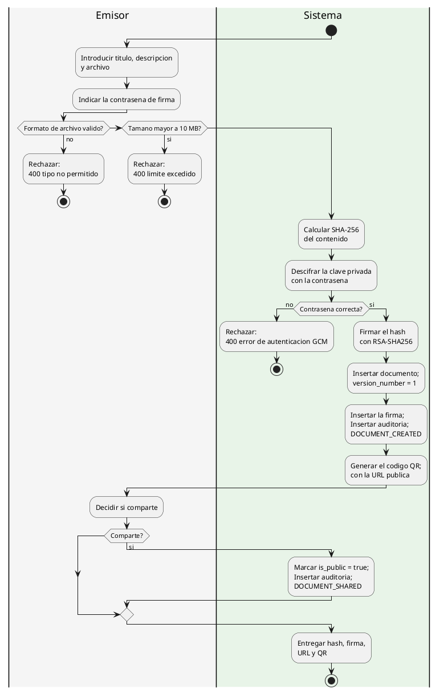
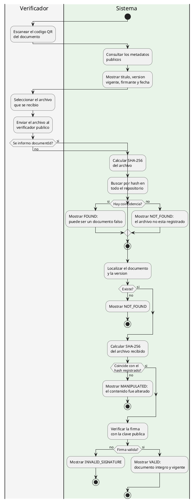
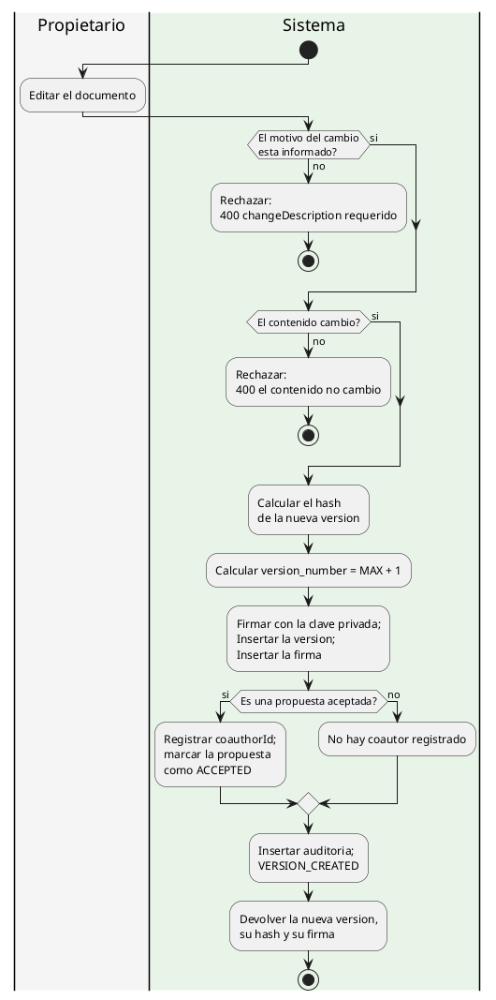
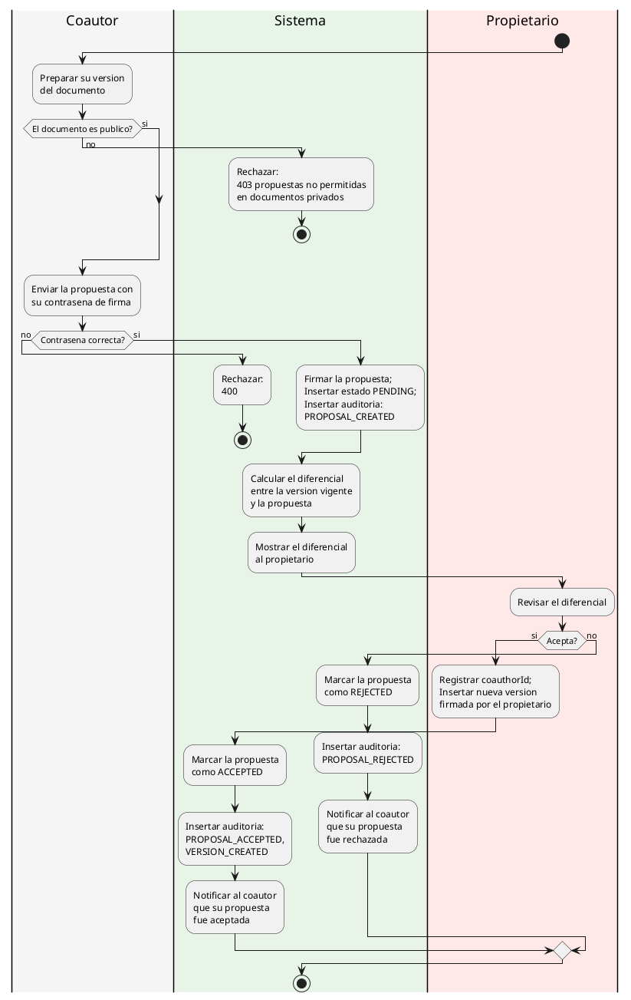
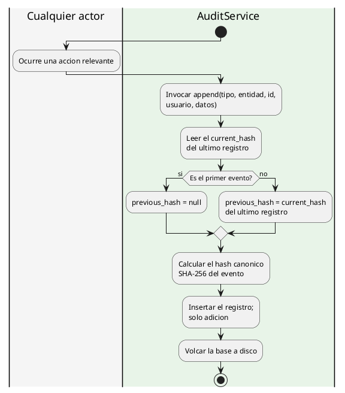
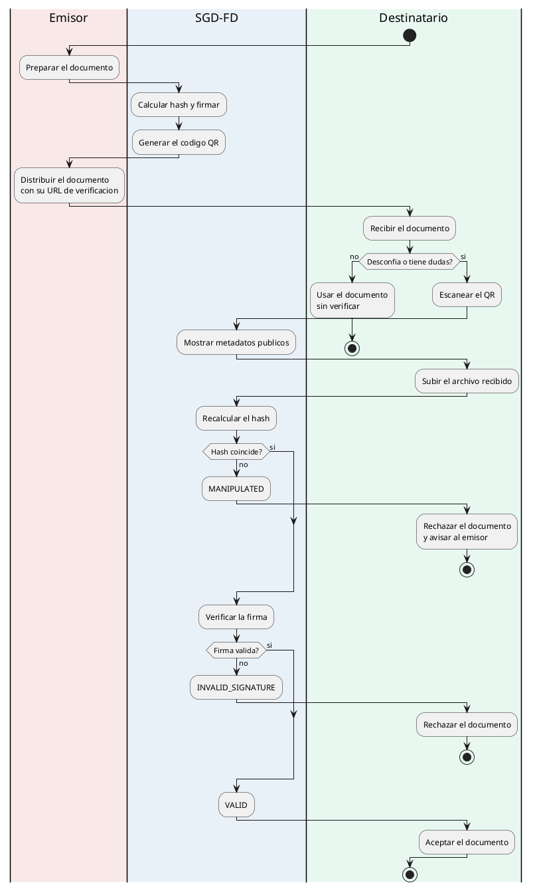

# Diagramas de Actividades — SGD-FD

**Proyecto:** Sistema de Gestión Documental con Firma Digital y Trazabilidad
**Tipo:** Diagrama de actividades (UML 2.5)
**Notación:** PlantUML

---

## 1. Propósito

Modelar el flujo de trabajo del SGD-FD como secuencias de actividades,
decisiones y carriles que muestran **quién** hace **qué** y en **qué orden**.

Los diagramas de actividades son el puente natural entre el proceso de negocio
(AS-IS y TO-BE) y la implementación: describen el flujo sin mezclar detalle de
interfaz con detalle de base de datos.

---

## 2. Actividad 1 · Emisión y distribución de un documento

### 2.1. Puntos de decisión

| # | Decisión | Camino «sí» | Camino «no» |
|---|----------|-------------|-------------|
| D-1 | ¿Formato de archivo válido? | Continúa | `400` |
| D-2 | ¿Tamaño mayor a 10 MB? | `400` | Continúa |
| D-3 | ¿Contraseña correcta? | Firma | `400` |
| D-4 | ¿Comparte el documento? | Marca público | Permanece privado |

---

## 3. Actividad 2 · Verificación de un documento recibido

### 3.1. Reglas del flujo

| Regla | Aplicación |
|-------|------------|
| R-1 | El verificador nunca necesita una cuenta |
| R-2 | Sin `documentId`, la búsqueda es por hash |
| R-3 | El hash se compara antes que la firma |
| R-4 | Cada fallo produce un mensaje distinto y accionable |

---

## 4. Actividad 3 · Publicación de una nueva versión

---

## 5. Actividad 4 · Gestión de una propuesta de coautoría

---

## 6. Actividad 5 · Registro en la auditoría

---

## 7. Actividad 6 · Proceso completo de extremo a extremo

---

## 8. Comparación de Flujos AS-IS y TO-BE

| Aspecto | AS-IS | TO-BE |
|---------|-------|-------|
| Emisión | ~2 h, sin firma | < 2 s, firmada |
| Distribución | Correo, sin trazabilidad | QR y evento auditable |
| Verificación | Contacto con el emisor, ~1 h | < 2 s, automática, sin cuenta |
| Versionado | ~4 h, sufijos en el nombre | < 1 s, numeración correlativa |
| Coautoría | ~3 días, autoría no registrada | ~5 min, coautor firmado |
| Auditoría | Imposible de reconstruir | Cadena verificable en < 100 ms |
| Tiempo total del ciclo | **~3,5 días** | **~5 min** |

---

## 9. Reglas de Negocio Representadas

| Regla | Actividad | Diagrama |
|-------|-----------|----------|
| Toda versión se firma automáticamente | 1 | Emisión |
| El motivo del cambio es obligatorio | 3 | Versionado |
| No se aceptan versiones sin cambios reales | 3 | Versionado |
| Las propuestas solo existen en documentos públicos | 4 | Coautoría |
| Solo el propietario acepta o rechaza | 4 | Coautoría |
| La bitácora es de solo adición | 5 | Auditoría |
| La verificación es pública | 2 y 6 | Verificación |

---

## 10. Referencias Cruzadas

- [`diagrama_secuencia.md`](diagrama_secuencia.md) — Diagramas de secuencia
- [`diagrama_estados.md`](diagrama_estados.md) — Máquinas de estado
- [`../02_diseno_construccion/procesos_empresa/as_is/procesos_as_is.md`](../02_diseno_construccion/procesos_empresa/as_is/procesos_as_is.md) — Mapa de procesos AS-IS
- [`../02_diseno_construccion/procesos_empresa/to_be/procesos_to_be.md`](../02_diseno_construccion/procesos_empresa/to_be/procesos_to_be.md) — Mapa de procesos TO-BE
