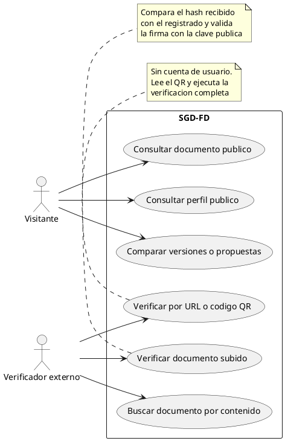
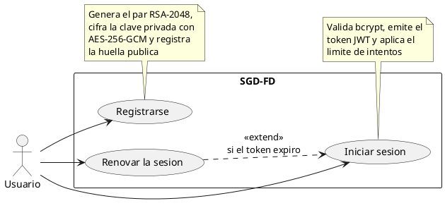
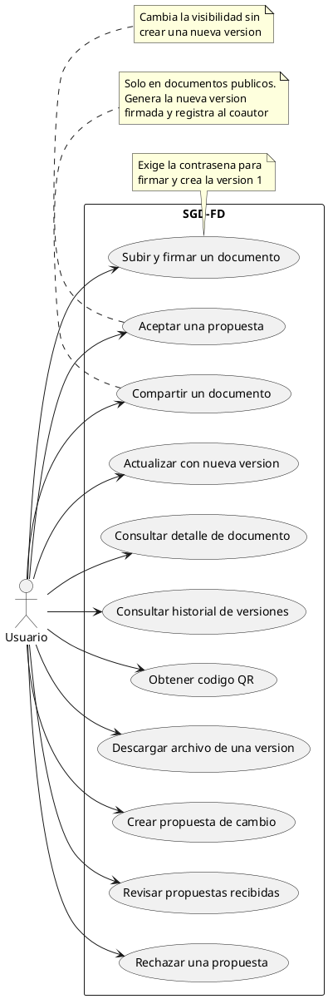
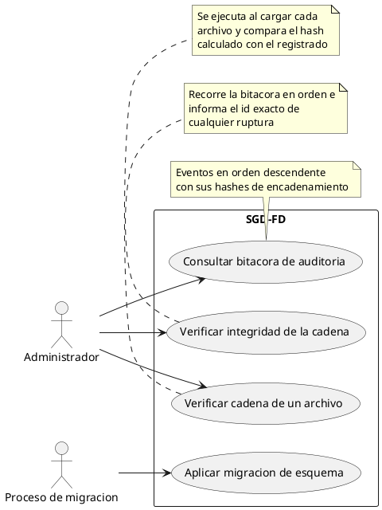

# Diagramas de Casos de Uso — SGD-FD

**Proyecto:** Sistema de Gestión Documental con Firma Digital y Trazabilidad
**Tipo:** Diagrama de casos de uso (UML 2.5)
**Notación:** PlantUML
**Total de casos de uso:** 24 (CU-001 a CU-024)

---

## 1. Propósito

Representar las funcionalidades del SGD-FD desde la perspectiva de los actores:
quién puede hacer qué y bajo qué condiciones.

Los 24 casos de uso se distribuyen en cuatro diagramas, agrupados por actor
principal. La especificación completa de cada caso está en
[`casos_uso.md`](../01_planificacion_requerimientos/requerimientos/casos_uso.md).

---

## 2. Actores del Sistema

| Actor | Descripción | Autenticación |
|-------|-------------|---------------|
| **Visitante** | Consulta documentos y perfiles públicos | Ninguna |
| **Verificador externo** | Comprueba la integridad de un documento recibido | Ninguna |
| **Usuario** | Registra la cuenta, emite documentos y propone cambios | JWT |
| **Administrador** | Supervisor, consulta la bitácora y verifica la cadena | JWT con rol `admin` |
| **Proceso de migración** | Ejecuta el esquema de base de datos al arrancar | — |

---

## 3. Diagrama 1 · Visitante y verificación pública

| Caso | Descripción | Actor |
|:----:|-------------|-------|
| CU-004 | Consultar el perfil público de un usuario | Visitante |
| CU-011 | Consultar un documento público | Visitante |
| CU-017 | Comparar versiones o propuestas | Visitante |
| CU-018 | Verificar un documento subido | Verificador externo |
| CU-019 | Buscar un documento por su contenido | Verificador externo |
| CU-020 | Verificar por URL o código QR | Verificador externo |

**Característica común:** ninguno requiere cuenta. Es el cambio funcional más
relevante respecto del proceso AS-IS, donde la verificación exigía contactar con
quien emitió el documento.

---

## 4. Diagrama 2 · Identidad y sesión

| Caso | Descripción | Actor |
|:----:|-------------|-------|
| CU-001 | Registrarse | Usuario |
| CU-002 | Iniciar sesión | Usuario |
| CU-003 | Renovar la sesión | Usuario |

---

## 5. Diagrama 3 · Emisión, versionado y coautoría

| Caso | Descripción | Actor |
|:----:|-------------|-------|
| CU-005 | Subir y firmar un documento | Usuario propietario |
| CU-006 | Actualizar un documento con una nueva versión | Usuario propietario |
| CU-007 | Consultar el detalle de un documento | Usuario autenticado |
| CU-008 | Consultar el historial de versiones | Usuario autenticado |
| CU-009 | Obtener el código QR de verificación | Usuario propietario |
| CU-010 | Compartir un documento | Usuario propietario |
| CU-012 | Descargar el archivo de una versión | Según visibilidad |
| CU-013 | Crear una propuesta de cambio | Usuario coautor |
| CU-014 | Revisar las propuestas recibidas | Usuario propietario |
| CU-015 | Aceptar una propuesta | Usuario propietario |
| CU-016 | Rechazar una propuesta | Usuario propietario |

---

## 6. Diagrama 4 · Administración y sistema

| Caso | Descripción | Actor |
|:----:|-------------|-------|
| CU-021 | Consultar la bitácora de auditoría | Administrador |
| CU-022 | Verificar la integridad de la cadena de auditoría | Administrador |
| CU-023 | Verificar la cadena de integridad de un archivo (automático) | Automático |
| CU-024 | Aplicar la migración de esquema (automático) | Automático |

---

## 7. Relaciones entre Casos de Uso

| Tipo | Relación | Casos |
|------|----------|-------|
| `<<extend>>` | Se ejecuta si el token expiró | CU-003 → CU-002 |
| `<<extend>>` | Se ejecuta al compartir | CU-010 → CU-009 |
| `<<extend>>` | Se ejecuta al aceptar | CU-015 → CU-005 |
| `<<include>>` | Siempre se ejecuta | CU-018 → CU-020 |
| Generalización | Comportamiento común de descarga | CU-012 cubre público y privado |
| Generalización | Comportamiento común de resolución | CU-015 y CU-016 comparten validación de propietario |

---

## 8. Restricciones de Acceso

| Caso de uso | Sin sesión | Con sesión | Solo propietario | Solo admin |
|-------------|:---------:|:----------:|:----------------:|:----------:|
| CU-004, CU-011, CU-017 | Sí | Sí | — | — |
| CU-018, CU-019, CU-020 | Sí | Sí | — | — |
| CU-001, CU-002 | Sí | — | — | — |
| CU-003 | — | Sí | — | — |
| CU-005, CU-006, CU-009, CU-010 | — | Sí | Sí | — |
| CU-007, CU-008, CU-012 | — | Sí | Según visibilidad | — |
| CU-013 | — | Sí | — | — |
| CU-014, CU-015, CU-016 | — | Sí | Sí | — |
| CU-021, CU-022, CU-023 | — | — | — | Sí |
| CU-024 | — | — | — | Automático |

**Observación:** CU-012 (descargar) tiene un comportamiento dual: es público
cuando el documento está compartido y exige autenticación y autorización cuando
es privado.

---

## 9. Cobertura de los Actores

| Actor | Casos de uso asignados | Total |
|-------|------------------------|:-----:|
| Visitante | CU-004, CU-011, CU-017 | 3 |
| Verificador externo | CU-018, CU-019, CU-020 | 3 |
| Usuario | CU-001 a CU-016, CU-012 | 16 |
| Administrador | CU-021, CU-022, CU-023 | 3 |
| Proceso de migración | CU-024 | 1 |

*Un caso puede atender a más de un actor; por eso la suma supera 24.*

---

## 10. Referencias Cruzadas

- [`casos_uso.md`](../01_planificacion_requerimientos/requerimientos/casos_uso.md) — Especificación de los 24 casos de uso
- [`historias_usuario.md`](../01_planificacion_requerimientos/requerimientos/historias_usuario.md) — Historias de usuario
- [`diagrama_secuencia.md`](diagrama_secuencia.md) — Diagrama de secuencia
- [`diagrama_actividades.md`](diagrama_actividades.md) — Diagrama de actividades
- [`diagrama_estados.md`](diagrama_estados.md) — Máquinas de estado
