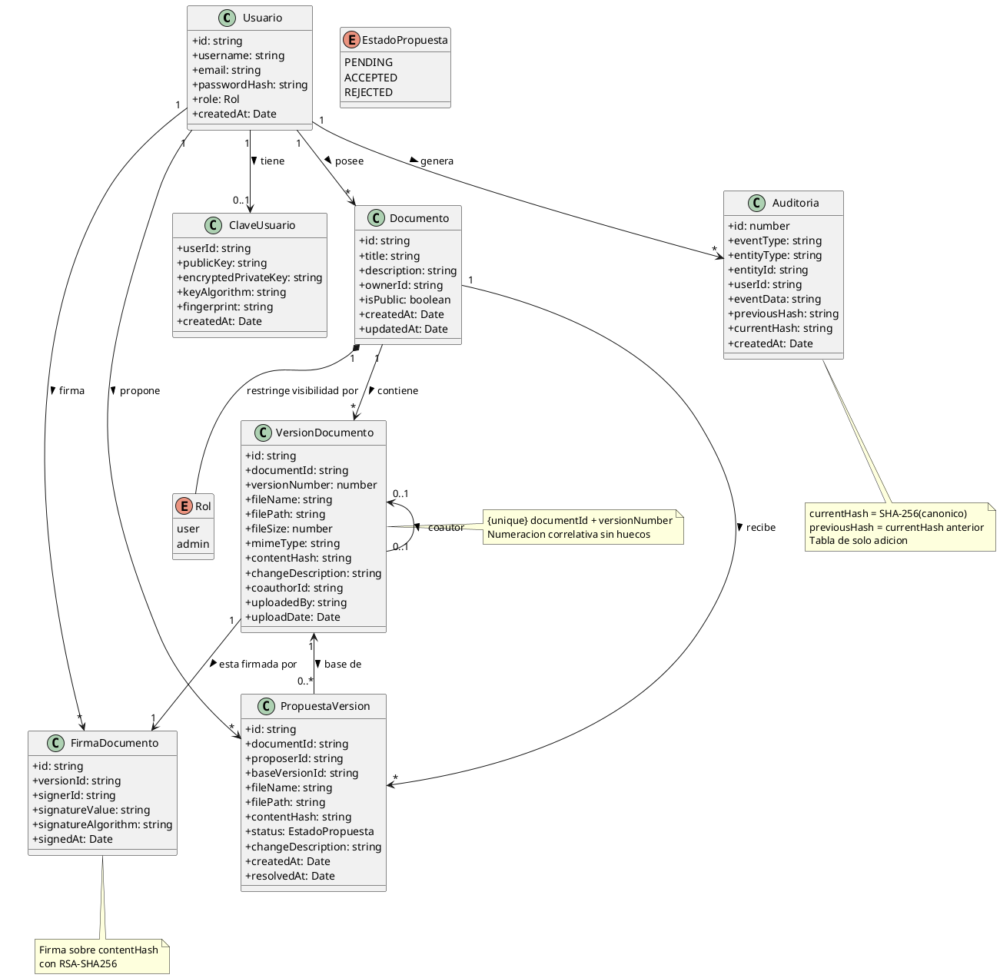
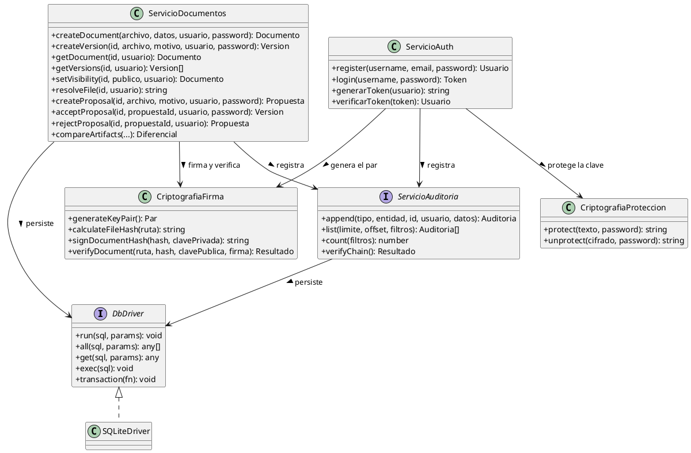

# Diagrama de Clases — SGD-FD

**Proyecto:** Sistema de Gestión Documental con Firma Digital y Trazabilidad
**Tipo:** Diagrama estructural de clases (UML 2.5)
**Notación:** PlantUML

---

## 1. Propósito

Representar la estructura estática del SGD-FD: las entidades de datos, sus
atributos, sus relaciones y los métodos de los servicios que operan sobre
ellas.

La fuente de verdad es el esquema real de la base de datos, definido en
`backend/src/db/schema` y documentado en
[`../../02_diseno_construccion/arquitectura/modelo_datos.md`](../02_diseno_construccion/arquitectura/modelo_datos.md).

---

## 2. Diagrama General de Clases



---

## 3. Detalle de las Entidades

### 3.1. Usuario

| Atributo | Tipo | Restricción | Descripción |
|----------|------|-------------|-------------|
| `id` | `string` | Clave primaria, UUID | Identificador único |
| `username` | `string` | Único, 3–50 caracteres | Nombre de acceso |
| `email` | `string` | Único, formato válido | Correo de contacto |
| `passwordHash` | `string` | bcryptjs, coste 12 | Hash de la contraseña |
| `role` | `Rol` | `user` por defecto | Permisos |
| `createdAt` | `Date` | ISO 8601 | Momento de registro |

**Métodos asociados** (en `AuthService`):

| Método | Responsabilidad |
|--------|-----------------|
| `register()` | Crear usuario, generar par RSA-2048, cifrar la clave privada |
| `login()` | Verificar contraseña, emitir JWT |
| `getProfile()` | Devolver datos del usuario autenticado |

### 3.2. ClaveUsuario

| Atributo | Tipo | Restricción | Descripción |
|----------|------|-------------|-------------|
| `userId` | `string` | Clave primaria, clave foránea | Usuario propietario |
| `publicKey` | `string` | PEM | Clave pública RSA-2048 |
| `encryptedPrivateKey` | `string` | JSON | `{ encryptedData, iv, authTag, salt }` |
| `keyAlgorithm` | `string` | `RSA-2048` | Algoritmo declarado |
| `fingerprint` | `string` | SHA-256 con `:` | Huella de la clave pública |
| `createdAt` | `Date` | ISO 8601 | Momento de generación |

**Invariante:** un usuario tiene como máximo una clave. La clave privada nunca
se almacena en claro.

### 3.3. Documento

| Atributo | Tipo | Restricción | Descripción |
|----------|------|-------------|-------------|
| `id` | `string` | Clave primaria, UUID | Identificador |
| `title` | `string` | 1–200 caracteres | Título |
| `description` | `string` | Opcional | Descripción |
| `ownerId` | `string` | Clave foránea a `Usuario` | Propietario |
| `isPublic` | `boolean` | Por defecto `false` | Visibilidad |
| `createdAt` | `Date` | ISO 8601 | Creación |
| `updatedAt` | `Date` | ISO 8601 | Última modificación |

**Métodos asociados** (en `DocumentService`):

| Método | Responsabilidad |
|--------|-----------------|
| `createDocument()` | Crear documento y firmar la versión 1 |
| `createVersion()` | Crear la siguiente versión firmada |
| `getDocument()` | Consultar con control de permisos |
| `getVersions()` | Historial completo |
| `setVisibility()` | Compartir o dejar de compartir |
| `resolveFile()` | Resolver la ruta del archivo validando permisos |
| `compareArtifacts()` | Comparar versiones o propuestas |

### 3.4. VersionDocumento

| Atributo | Tipo | Restricción | Descripción |
|----------|------|-------------|-------------|
| `id` | `string` | Clave primaria, UUID | Identificador |
| `documentId` | `string` | Clave foránea, parte de la clave única | Documento al que pertenece |
| `versionNumber` | `number` | 1, 2, 3… correlativo | Número de versión |
| `fileName` | `string` | — | Nombre original |
| `filePath` | `string` | — | Ruta en disco |
| `fileSize` | `number` | ≤ 10 MB | Tamaño en bytes |
| `mimeType` | `string` | Lista blanca | Tipo MIME |
| `contentHash` | `string` | SHA-256, 64 hex | Huella del contenido |
| `changeDescription` | `string` | **Obligatorio**, 1–500 | Motivo del cambio |
| `coauthorId` | `string` | Opcional, clave foránea | Coautor aceptado |
| `uploadedBy` | `string` | Clave foránea | Quien subió |
| `uploadDate` | `Date` | ISO 8601 | Momento de la subida |

**Restricción crítica:** `UNIQUE(document_id, version_number)`. Es la garantía
de que nunca existirán dos versiones con el mismo número.

### 3.5. FirmaDocumento

| Atributo | Tipo | Restricción | Descripción |
|----------|------|-------------|-------------|
| `id` | `string` | Clave primaria, UUID | Identificador |
| `versionId` | `string` | Clave foránea, único | Versión firmada |
| `signerId` | `string` | Clave foránea a `Usuario` | Firmante |
| `signatureValue` | `string` | Base64 | Firma RSA |
| `signatureAlgorithm` | `string` | `RSA-SHA256` | Algoritmo |
| `signedAt` | `Date` | ISO 8601 | Momento de la firma |

**Invariante:** una versión tiene exactamente una firma. No existe la versión
sin firmar.

### 3.6. PropuestaVersion

| Atributo | Tipo | Restricción | Descripción |
|----------|------|-------------|-------------|
| `id` | `string` | Clave primaria, UUID | Identificador |
| `documentId` | `string` | Clave foránea | Documento |
| `proposerId` | `string` | Clave foránea a `Usuario` | Coautor |
| `baseVersionId` | `string` | Clave foránea | Versión base de la propuesta |
| `contentHash` | `string` | SHA-256 | Huella del contenido propuesto |
| `status` | `EstadoPropuesta` | Por defecto `PENDING` | Estado |
| `changeDescription` | `string` | — | Motivo |
| `createdAt` | `Date` | ISO 8601 | Creación |
| `resolvedAt` | `Date` | Opcional | Resolución |

**Máquina de estados**:

```
PENDING --> ACCEPTED   (el propietario acepta)
PENDING --> REJECTED   (el propietario rechaza)
```

No hay otras transiciones. Una propuesta resuelta es inmutable.

### 3.7. Auditoria

| Atributo | Tipo | Restricción | Descripción |
|----------|------|-------------|-------------|
| `id` | `number` | Clave primaria, autoincremental | Posición en la cadena |
| `eventType` | `string` | Catálogo de eventos | Tipo de evento |
| `entityType` | `string` | — | Entidad afectada |
| `entityId` | `string` | — | Identificador de la entidad |
| `userId` | `string` | Opcional | Autor del evento |
| `eventData` | `string` | JSON | Detalle del evento |
| `previousHash` | `string` | `null` en el primero | Eslabón anterior |
| `currentHash` | `string` | SHA-256, 64 hex | Hash del evento |
| `createdAt` | `Date` | ISO 8601 | Momento |

**Invariantes**:

1. `previous_hash` de la fila *n* es igual a `current_hash` de la fila *n-1*.
2. `current_hash = SHA-256(canonicalización de la fila)`.
3. No existen operaciones de actualización ni de borrado sobre esta tabla.

---

## 4. Diagrama de la Capa de Servicios



---

## 5. Tabla de Correspondencia

| Clase del diagrama | Tabla real | Archivo del código |
|--------------------|------------|---------------------|
| `Usuario` | `users` | `db/schema` |
| `ClaveUsuario` | `user_keys` | `db/schema` |
| `Documento` | `documents` | `db/schema` |
| `VersionDocumento` | `document_versions` | `db/schema` |
| `FirmaDocumento` | `document_signatures` | `db/schema` |
| `PropuestaVersion` | `version_proposals` | `db/schema` |
| `Auditoria` | `audit_log` | `db/schema` |
| `ServicioAuth` | — | `services/auth.service.ts` |
| `ServicioDocumentos` | — | `services/document.service.ts` |
| `ServicioAuditoria` | — | `services/audit.service.ts` |
| `CriptografiaFirma` | — | `crypto/signature.ts`, `crypto/verification.ts` |
| `CriptografiaProteccion` | — | `crypto/keyProtection.ts` |
| `DbDriver` | — | `db/driver.ts` |

---

## 6. Código de Generación

El diagrama se genera con PlantUML. Para obtener la imagen:

```bash
plantuml diagrama_clases.puml
```

O mediante un servicio web que acepte el código anterior. El texto de este
documento **es** la especificación del diagrama: no existe una imagen
diferente que pueda divergir del contenido.

---

## 7. Referencias Cruzadas

- [`modelo_datos.md`](../02_diseno_construccion/arquitectura/modelo_datos.md) — Esquema de la base de datos
- [`diagrama_componentes.md`](diagrama_componentes.md) — Diagrama de componentes
- [`diagrama_paquetes.md`](diagrama_paquetes.md) — Diagrama de paquetes
- [`../../02_diseno_construccion/arquitectura/arquitectura.md`](../02_diseno_construccion/arquitectura/arquitectura.md) — Arquitectura
