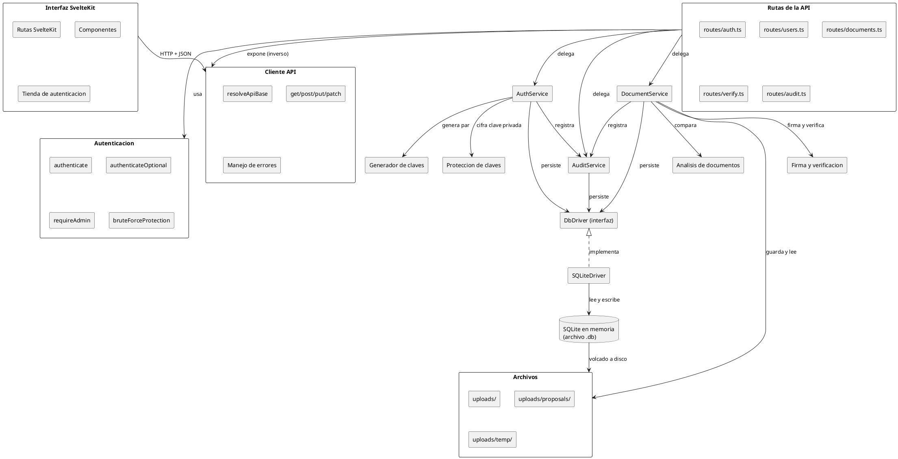

# Diagrama de Componentes — SGD-FD

**Proyecto:** Sistema de Gestión Documental con Firma Digital y Trazabilidad
**Tipo:** Diagrama estructural de componentes (UML 2.5)
**Notación:** PlantUML

---

## 1. Propósito

Representar cómo se articulan los módulos del SGD-FD entre sí: qué
componentes existen, qué interfaces ofrecen y qué dependencias tienen.

A diferencia del diagrama de clases, que describe **los datos**, este describe
**el software**.

---

## 2. Diagrama de Componentes



---

## 3. Inventario de Componentes

| # | Componente | Responsabilidad | Depende de |
|:-:|------------|-----------------|------------|
| 1 | Interfaz SvelteKit | Presentación y navegación | Cliente API |
| 2 | Cliente API | Comunicación HTTP y resolución de URL | — |
| 3 | Rutas de la API | Validación de entrada y códigos de estado | Autenticación, servicios |
| 4 | Autenticación | Verificación de token, roles, límite de intentos | — |
| 5 | `AuthService` | Registro, inicio de sesión, tokens | Criptografía, auditoría, base de datos |
| 6 | `DocumentService` | Lógica documental completa | Análisis, firma, auditoría, base de datos, archivos |
| 7 | `AuditService` | Bitácora encadenada | Base de datos |
| 8 | Análisis de documentos | Extracción de texto y diferencial | Sistema de archivos |
| 9 | Generador de claves | Par RSA-2048 y huella | `node:crypto` |
| 10 | Protección de claves | PBKDF2 y AES-256-GCM | `node:crypto` |
| 11 | Firma y verificación | SHA-256, RSA-SHA256, comprobación | `node:crypto` |
| 12 | `DbDriver` | Contrato de persistencia | — |
| 13 | `SQLiteDriver` | Implementación sobre `sql.js` | `DbDriver` |
| 14 | Archivos | Almacenamiento de documentos | Sistema de archivos |

---

## 4. Interfaces Expuestas por Cada Componente

### 4.1. Componente: Rutas de la API

```ts
interface IRutasDocumentos {
  GET    /api/docs                          // lista, requiere authenticate
  POST   /api/docs                          // emite y firma, requiere password
  GET    /api/docs/:id                      // detalle, requiere authenticate
  PUT    /api/docs/:id                      // nueva versión firmada
  GET    /api/docs/:id/versions             // historial
  GET    /api/docs/:id/qr                   // código QR
  GET    /api/docs/:id/public               // público, sin autenticación
  PATCH  /api/docs/:id/visibility           // compartir
  GET    /api/docs/:id/file                 // descarga, authenticateOptional
  GET    /api/docs/:id/proposals            // lista de propuestas
  POST   /api/docs/:id/proposals            // crea propuesta firmada
  GET    /api/docs/:id/proposals/:pid/file  // descarga de propuesta
  POST   /api/docs/:id/proposals/:pid/accept
  POST   /api/docs/:id/proposals/:pid/reject
  GET    /api/docs/:id/compare              // diferencial
}

interface IRutasVerificacion {
  POST   /api/verify                        // verificación con archivo, público
  GET    /api/verify/:documentId            // metadatos públicos, público
}

interface IRutasAuditoria {
  GET    /api/audit                         // requiere admin
  GET    /api/audit/verify-chain            // requiere admin
}
```

### 4.2. Componente: Interfaz `DbDriver`

```ts
interface DbDriver {
  run(sql: string, params?: unknown[]): void;
  all<T>(sql: string, params?: unknown[]): T[];
  get<T>(sql: string, params?: unknown[]): T | undefined;
  exec(sql: string): void;
  transaction(fn: () => void): void;
}
```

Esta interfaz es el **punto de sustitución** previsto para migrar a
PostgreSQL. La interfaz actual es síncrona, lo que constituye el bloqueo
principal del despliegue en la nube.

### 4.3. Componente: Criptografía

```ts
interface ICriptografia {
  generateKeyPair(): { publicKey: string; privateKey: string; fingerprint: string };
  protect(texto: string, password: string): string;
  unprotect(cifrado: string, password: string): string;
  calculateFileHash(ruta: string): string;
  signDocumentHash(hash: string, privateKey: string): string;
  verifyDocument(ruta: string, hash: string, publicKey: string, firma: string): Resultado;
}
```

---

## 5. Reglas de Dependencia

| Regla | Descripción | Cumplimiento |
|-------|-------------|:------------:|
| R-1 | La interfaz no importa nada de la API | ✔ Cumple |
| R-2 | El cliente no accede a la base de datos | ✔ Cumple |
| R-3 | Las rutas no contienen lógica de negocio | ✔ Cumple |
| R-4 | La criptografía no depende del resto del proyecto | ✔ Cumple |
| R-5 | Solo `DbDriver` conoce el motor concreto | ✔ Cumple |
| R-6 | Los servicios no conocen el framework HTTP | ✔ Cumple |
| R-7 | Solo `AuditService` escribe en `audit_log` | ✔ Cumple |

La regla R-5 es la más relevante para la mantenibilidad: si mañana se sustituye
`SQLiteDriver` por `PostgresDriver`, ningún otro archivo debe cambiar, salvo
por el efecto de la sincronía descrito en el plan de nube.

---

## 6. Puntos de Acoplamiento Identificados

| Punto | Componentes | Tipo de acoplamiento | Impacto |
|-------|-------------|----------------------|---------|
| P-1 | `DbDriver` y todos los servicios | Síncrono, de interfaz | **Alto**: bloquea PostgreSQL |
| P-2 | `DocumentService` y el sistema de archivos | Directo | Medio: requiere Storage en la nube |
| P-3 | `Rutas` y `multer` | Directo | Bajo: estable en ambos entornos |
| P-4 | `AuditService` y `node:crypto` | Directo | Bajo: sin alternativa razonable |
| P-5 | `DocumentService` y `DocumentAnalysis` | Por ruta de archivo | Medio: debe abstraerse el almacenamiento |

---

## 7. Referencias Cruzadas

- [`diagrama_clases.md`](diagrama_clases.md) — Diagrama de clases
- [`diagrama_paquetes.md`](diagrama_paquetes.md) — Diagrama de paquetes
- [`diagrama_despliegue.md`](diagrama_despliegue.md) — Diagrama de despliegue
- [`../../02_diseno_construccion/arquitectura/arquitectura.md`](../02_diseno_construccion/arquitectura/arquitectura.md) — Arquitectura
- [`../04_implementacion_despliegue/plan_nube_vercel_supabase.md`](../04_implementacion_despliegue/plan_nube_vercel_supabase.md) — Plan de nube
