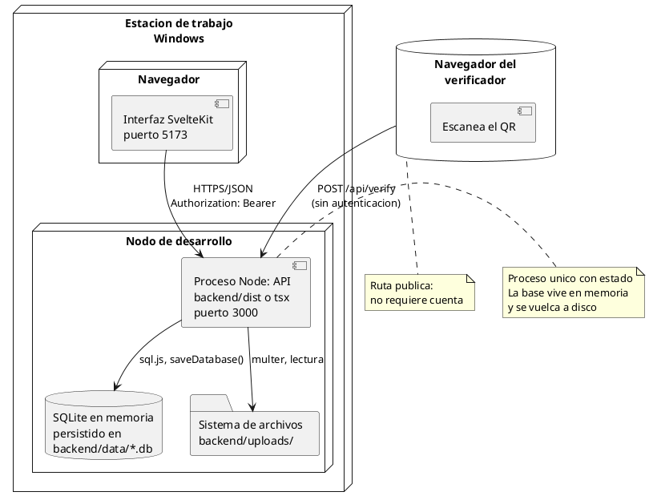
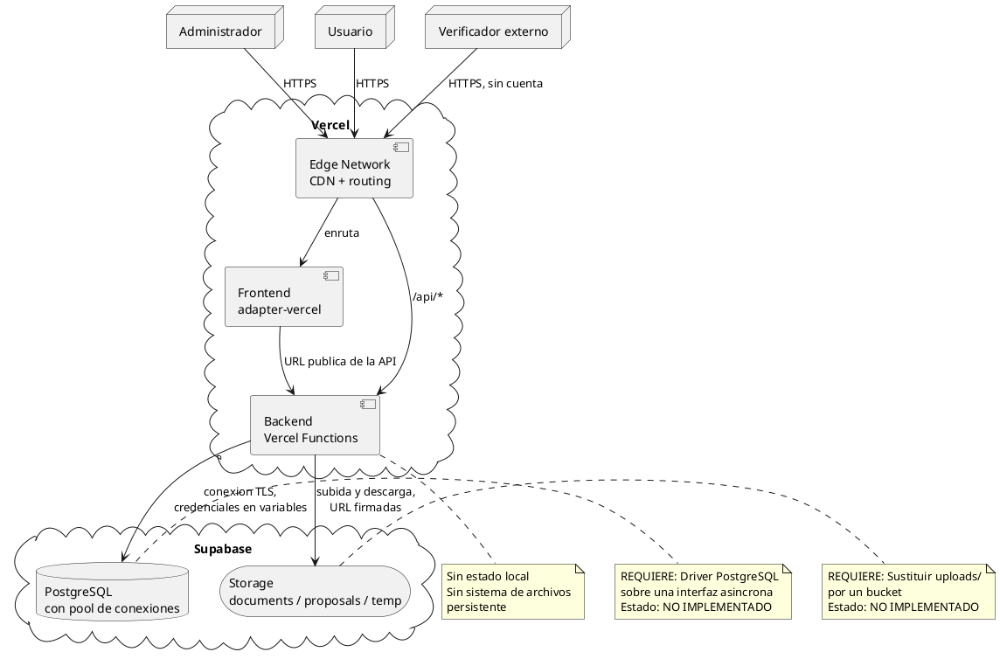

# Diagrama de Despliegue — SGD-FD

**Proyecto:** Sistema de Gestión Documental con Firma Digital y Trazabilidad
**Tipo:** Diagrama de despliegue (UML 2.5)
**Notación:** PlantUML

---

## 1. Propósito

Representar la distribución física del SGD-FD: sobre qué equipos y procesos se
ejecuta cada componente, qué protocolo se usa para comunicarse y qué datos
persisten.

Se documentan **dos entornos**: el actual (local, operativo) y el previsto
(nube, planificado). La distinción es deliberada y se mantiene explícita en
todos los artefactos del proyecto.

---

## 2. Entorno Actual: Servidor Local



### 2.1. Inventario de nodos

| Nodo | Componentes | Puerto | Estado |
|------|-------------|:------:|:------:|
| Nodo de desarrollo | API Express, SQLite, archivos | 3000 | **Operativo** |
| Navegador del usuario | Interfaz SvelteKit | 5173 | **Operativo** |
| Navegador del verificador | Página pública | — | **Operativo** |

### 2.2. Protocolos y datos

| Origen | Destino | Protocolo | Datos | Autenticación |
|--------|----------|-----------|-------|---------------|
| Navegador | API | HTTP/JSON | Documentos, propuestas, tokens | JWT en cabecera |
| Verificador | API | HTTP/JSON | Archivo a verificar | **Ninguna** |
| API | SQLite | `sql.js` en memoria | 7 tablas | — |
| API | Sistema de archivos | E/S local | Documentos y propuestas | Permisos del proceso |
| API | Bitácora | SHA-256 encadenado | Eventos | — |

---

## 3. Entorno Previsto: Nube



---

## 4. Comparación de Entornos

| Aspecto | Local (actual) | Nube (previsto) | Impacto |
|---------|----------------|-----------------|---------|
| Estado de la API | Proceso con memoria | Función sin estado | La base debe ser externa |
| Persistencia | Archivo `.db` en disco | PostgreSQL | Requiere driver nuevo |
| Archivos | `uploads/` | Supabase Storage | Requiere sustitución |
| Escalado | Un proceso | Instancias concurrentes | Exige índices y claves foráneas correctas |
| Coste | Cero | Según uso | No estimado |
| Disponibilidad | Mientras el equipo esté encendido | 99,9 % según el plan | Diferencia cualitativa |
| Autenticación | JWT | JWT | Sin cambios |

---

## 5. Bloqueos del Entorno de Nube

| # | Bloqueo | Componente afectado | Consecuencia |
|:-:|---------|---------------------|--------------|
| 1 | Base de datos en memoria | Backend | Cada invocación tendría datos distintos |
| 2 | Interfaz `DbDriver` síncrona | Backend | `pg` exige promesas |
| 3 | Archivos en disco local | Backend | Lo subido se perdería |
| 4 | `adapter-vercel` no instalado | Frontend | La compilación falla con `ADAPTER=vercel` |
| 5 | Dialecto SQL distinto | Backend | `AUTOINCREMENT`, `?` y `TEXT` no son compatibles |

### 5.1. Estado del código frente a la nube

| Componente | ¿Preparado? | Observación |
|------------|:-----------:|-------------|
| Criptografía | ✔ | Independiente del entorno |
| Servicios de negocio | ✔ | No dependen del framework HTTP |
| Cliente de la interfaz | ✔ | La URL base es configurable |
| Rutas de verificación públicas | ✔ | No dependen del almacenamiento |
| Capa de datos | ✘ | Es el bloqueo principal |
| Almacenamiento de archivos | ✘ | Es el bloqueo secundario |

El detalle completo de la migración está en
[`../04_implementacion_despliegue/plan_nube_vercel_supabase.md`](../04_implementacion_despliegue/plan_nube_vercel_supabase.md).

---

## 6. Requisitos por Nodo

### 6.1. Nodo local

| Recurso | Mínimo | Recomendado |
|---------|:------:|-------------|
| Node.js | 18 | 20 o superior |
| Memoria | 256 MB | 512 MB |
| Disco | 500 MB | 2 GB con documentos |
| Puertos libres | 3000, 5173 | — |

### 6.2. Nodo de desarrollo en la nube

| Recurso | Nota |
|---------|------|
| Plan de Vercel | Hobby para pruebas; Pro para producción |
| Plan de Supabase | Free hasta 500 MB de base y 1 GB de almacenamiento |
| Secretos | `JWT_SECRET`, `DATABASE_URL`, claves de Supabase |

---

## 7. Flujo de una Verificación Pública

```
 Verificador
     |
     | 1. Escanea el QR
     v
 Interfaz publica  ─── GET /api/verify/:documentId ───▶ API
     |                                                   |
     | 2. Muestra titulo, version, firmante              v
     |                                              PostgreSQL (previsto)
     |                                              o SQLite (actual)
     | 3. Selecciona el archivo que recibio
     |
     | 4. POST /api/verify  (archivo)
     v
 API:  calcular SHA-256
     -> consultar version y firma
     -> verificar RSA con la clave publica
     -> devolver VALID / MANIPULATED / INVALID_SIGNATURE / NOT_FOUND
     v
 Resultado en pantalla
```

Todo el flujo ocurre sin cuenta de usuario. Es la diferencia funcional
principal frente al proceso AS-IS, donde la verificación exigía contactar con
quien emitió el documento.

---

## 8. Referencias Cruzadas

- [`diagrama_componentes.md`](diagrama_componentes.md) — Diagrama de componentes
- [`software_utilizado.md`](software_utilizado.md) — Software utilizado
- [`../04_implementacion_despliegue/implementacion_despliegue.md`](../04_implementacion_despliegue/implementacion_despliegue.md) — Implementación y despliegue
- [`../04_implementacion_despliegue/plan_nube_vercel_supabase.md`](../04_implementacion_despliegue/plan_nube_vercel_supabase.md) — Plan de nube
