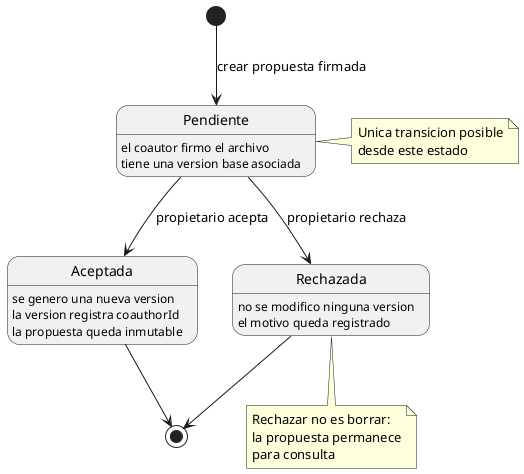
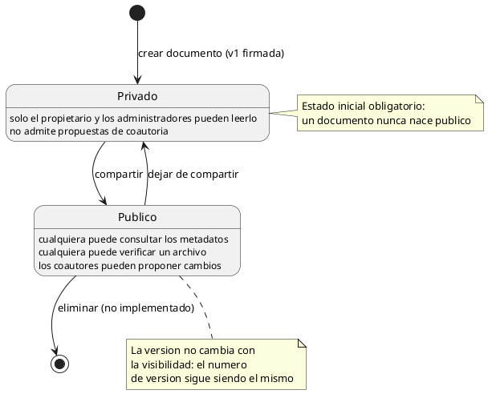
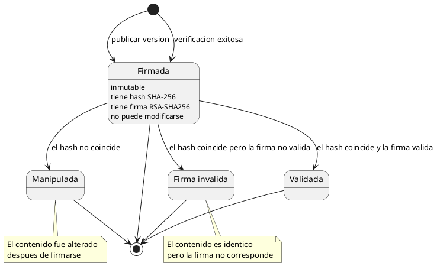
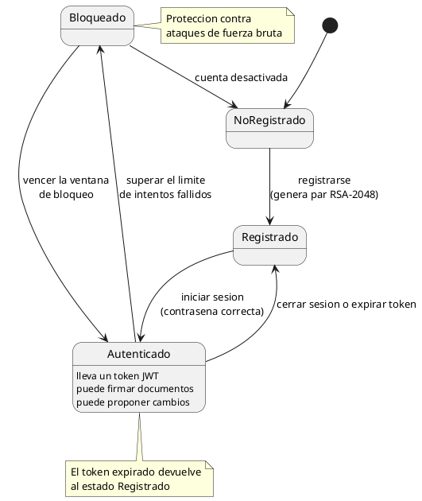
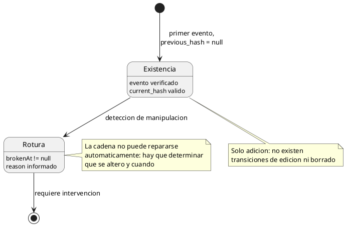

# Máquinas de Estado — SGD-FD

**Proyecto:** Sistema de Gestión Documental con Firma Digital y Trazabilidad
**Tipo:** Diagrama de máquina de estados (UML 2.5)
**Notación:** PlantUML

---

## 1. Propósito

Modelar el comportamiento de los objetos del SGD-FD a lo largo del tiempo:
en qué estado se encuentran, qué los hace cambiar de estado y qué acciones
externas provoke.

El sistema tiene cinco máquinas de estado relevantes. Se documentan todas,
porque cada una de ellas codifica una regla de negocio que de otro modo sería
difícil de observar.

---

## 2. Máquina de Estados 1 · Propuesta de coautoría

### 2.1. Transiciones

| Desde | Evento | Hacia | Condición | Efecto |
|-------|--------|-------|-----------|--------|
| (inicial) | `crearPropuesta` | `Pendiente` | Documento público y contraseña correcta | Firma la propuesta, inserta el registro, registra `PROPOSAL_CREATED` |
| `Pendiente` | `aceptar` | `Aceptada` | El solicitante es el propietario | Crea la versión firmada, registra `coauthorId`, marca `ACCEPTED` |
| `Pendiente` | `rechazar` | `Rechazada` | El solicitante es el propietario | No altera versiones, marca `REJECTED` |
| `Aceptada` | — | (final) | — | Inmutable |
| `Rechazada` | — | (final) | — | Inmutable |

### 2.2. Reglas codificadas

| Regla | Cómo se ve en la máquina |
|-------|--------------------------|
| Una propuesta resuelta es inmutable | No hay transiciones desde `Aceptada` ni `Rechazada` |
| Solo el propietario resuelve | La transición exige `usuario == propietario` |
| Rechazar no destruye evidencia | `Rechazada` es un estado final conservado, no una eliminación |
| Solo hay documentos públicos | La creación se condiciona a `is_public = true` |

---

## 3. Máquina de Estados 2 · Documento y sus versiones

### 3.1. Reglas codificadas

| Regla | Transición |
|-------|------------|
| Un documento nace privado | `[*] → Privado` |
| Solo el propietario cambia la visibilidad | `Privado ↔ Publico` |
| Compartir se audita | Registro `DOCUMENT_SHARED` |
| Compartir no crea versión | La visibilidad no es una versión |

---

## 4. Máquina de Estados 3 · Versión de un documento

### 4.1. Estados de verificación

| Estado devuelto | Significado | Causa técnica |
|------------------|-------------|---------------|
| `VALID` | Documento íntegro y firmado | Hash coincide, firma válida |
| `MANIPULATED` | El contenido fue alterado | Hash distinto del registrado |
| `INVALID_SIGNATURE` | La firma no corresponde | Clave pública que no valida |
| `NOT_FOUND` | No está en el repositorio | No existe el documento o la versión |
| `FOUND` | Existe un documento con ese hash | Búsqueda sin `documentId` |

### 4.2. Reglas codificadas

| Regla | Cómo se ve |
|-------|-----------|
| Toda versión nace firmada | `[*] → Firmada` sin alternativa |
| Una versión es inmutable | No hay transición de salida desde `Firmada` |
| La verificación no altera nada | `Validada`, `Manipulada` y `FirmaInvalida` son terminales |

---

## 5. Máquina de Estados 4 · Sesión de usuario

### 5.1. Reglas codificadas

| Regla | Transición |
|-------|-----------|
| El registro genera el par de claves | `NoRegistrado → Registrado` |
| Solo la contraseña correcta autentica | `Registrado → Autenticado` |
| El bloqueo se aplica al superar el límite | `Autenticado → Bloqueado` |
| El bloqueo expira solo | `Bloqueado → Autenticado` por tiempo |

**Pruebas que respaldan esta máquina:**

| Prueba | Archivo |
|--------|---------|
| `rechaza tokens inválidos o expirados` | `auth-middleware.test.ts` |
| `cuenta intentos fallidos y bloquea tras el máximo` | `rate-limit.test.ts` |
| `expira el bloqueo al pasar la ventana` | `rate-limit.test.ts` |
| `succeeded() limpia el acumulador` | `rate-limit.test.ts` |

---

## 6. Máquina de Estados 5 · Cadena de auditoría

### 6.1. Causas de rotura

| Causa | `reason` | Detección |
|-------|----------|-----------|
| Contenido de un evento modificado | `current_hash no coincide` | El hash recalculado difiere |
| Fila eliminada | `previous_hash no coincide` | La cadena salta un eslabón |
| Fila insertada | `previous_hash no coincide` | El enlace no apunta al anterior |
| Tabla reordenada | `previous_hash no coincide` | El orden de `id` ya no sigue la cadena |
| `event_data` corrupto | `event_data inválido` | No se puede canonicalizar |

### 6.2. Pruebas

| Prueba | Resultado |
|--------|-----------|
| `encadena los eventos con hashes SHA-256` | La cadena se construye |
| `verifica la cadena completa como válida` | Se valida íntegra |
| `es de solo-append: no se pueden actualizar ni borrar registros` | No hay edición ni borrado |
| `detecta una manipulación si se rompe el encadenamiento` | Se detecta la ruptura |
| `verifica la integridad de la cadena de auditoría` | La API expone el veredicto |

---

## 7. Resumen de las Máquinas de Estado

| # | Máquina | Estados | Transiciones | Terminales |
|:-:|---------|:-------:|:------------:|:----------:|
| 1 | Propuesta | 3 | 3 | 2 |
| 2 | Documento | 2 | 2 | 1 |
| 3 | Versión (ciclo de vida) | 1 | 0 | 1 |
| 4 | Versión (verificación) | 3 | 3 | 3 |
| 5 | Sesión | 4 | 5 | 1 |
| 6 | Cadena de auditoría | 2 | 1 | 1 |

**Total: 15 estados, 14 transiciones, 9 estados terminales.**

---

## 8. Reglas de Negocio Derivadas de las Máquinas de Estado

| # | Regla | Máquina |
|:-:|-------|---------|
| 1 | Una propuesta aceptada o rechazada es inmutable | Propuesta |
| 2 | Un documento nunca nace público | Documento |
| 3 | Toda versión nace firmada, sin excepción | Versión |
| 4 | La verificación no modifica el sistema | Versión (verificación) |
| 5 | El bloqueo por intentos fallidos expira solo | Sesión |
| 6 | La bitácora no admite edición ni borrado | Cadena |
| 7 | Una cadena rota requiere intervención, no reparación automática | Cadena |

---

## 9. Referencias Cruzadas

- [`diagrama_clases.md`](diagrama_clases.md) — Diagrama de clases
- [`diagrama_secuencia.md`](diagrama_secuencia.md) — Diagramas de secuencia
- [`diagrama_actividades.md`](diagrama_actividades.md) — Diagramas de actividades
- [`../02_diseno_construccion/pruebas_calidad/matriz_pruebas.md`](../02_diseno_construccion/pruebas_calidad/matriz_pruebas.md) — Pruebas que respaldan las transiciones
