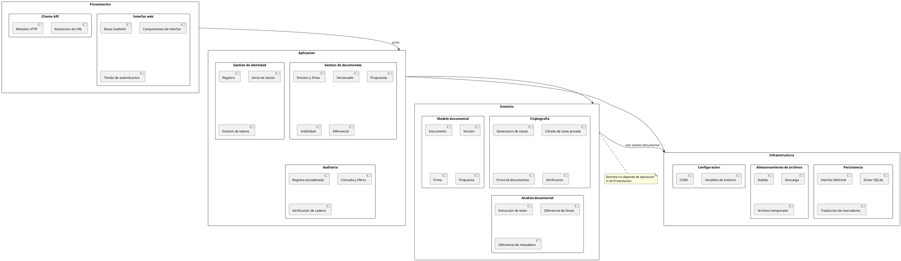

# Diagrama de Paquetes — SGD-FD

**Proyecto:** Sistema de Gestión Documental con Firma Digital y Trazabilidad
**Tipo:** Diagrama estructural de paquetes (UML 2.5)
**Notación:** PlantUML

---

## 1. Propósito

Organizar el sistema en paquetes funcionalmente coherentes, mostrar las
dependencias entre ellos y definir que interfaz expone cada uno.

El diagrama responde a la pregunta «¿qué hace cada parte del sistema y qué
necesita de las demás?».

---

## 2. Diagrama de Paquetes



---

## 3. Inventario de Paquetes

| # | Paquete | Función | Archivos principales |
|:-:|---------|---------|----------------------|
| 1 | Presentación / Interfaz web | Mostrar y capturar la interacción del usuario | `frontend/src/routes/`, componentes |
| 2 | Presentación / Cliente API | Comunicarse con la API | `frontend/src/lib/api.ts` |
| 3 | Aplicación / Gestión de documentos | Reglas del ciclo de vida documental | `backend/src/services/document.service.ts` |
| 4 | Aplicación / Gestión de identidad | Cuentas, sesión y permisos | `backend/src/services/auth.service.ts` |
| 5 | Aplicación / Auditoría | Trazabilidad de acciones | `backend/src/services/audit.service.ts` |
| 6 | Dominio / Criptografía | Primitivas criptográficas | `backend/src/crypto/` |
| 7 | Dominio / Modelo documental | Entidades y sus invariantes | Esquema de base de datos |
| 8 | Dominio / Análisis documental | Comparación de contenido | `backend/src/services/document-analysis.ts` |
| 9 | Infraestructura / Persistencia | Acceso a datos | `backend/src/db/` |
| 10 | Infraestructura / Almacenamiento | Gestión de archivos | `backend/uploads/` |
| 11 | Infraestructura / Configuración | Parámetros del entorno | `backend/src/config/` |

---

## 4. Dependencias Entre Paquetes

### 4.1. Matriz de dependencias

| Paquete | → 1 | → 2 | → 3 | → 4 | → 5 | → 6 | → 7 | → 8 | → 9 | → 10 | → 11 |
|---------|:---:|:---:|:---:|:---:|:---:|:---:|:---:|:---:|:---:|:----:|:----:|
| 1. Interfaz web | — | ✔ | | | | | | | | | ✔ |
| 2. Cliente API | | — | | | | | | | | | ✔ |
| 3. Gestión documental | | | — | | ✔ | ✔ | ✔ | ✔ | ✔ | ✔ | |
| 4. Gestión de identidad | | | | — | ✔ | ✔ | ✔ | | ✔ | | |
| 5. Auditoría | | | | | — | ✔ | | | ✔ | | |
| 6. Criptografía | | | | | | — | | | | | |
| 7. Modelo documental | | | | | | | — | | | | |
| 8. Análisis documental | | | | | | | | — | ✔ | | |
| 9. Persistencia | | | | | | | | | — | | |
| 10. Almacenamiento | | | | | | | | | | — | |
| 11. Configuración | | | | | | | | | | | — |

### 4.2. Reglas de la matriz

| Regla | Estado | Observación |
|-------|:------:|-------------|
| Ningún dominio depende de aplicación | ✔ | Las primitivas criptográficas no conocen quién las usa |
| Ningún dominio depende de presentación | ✔ | Independencia total |
| Infraestructura no depende de nada | ✔ | Es la capa más baja |
| Presentación no accede a infraestructura | ✔ | Toda comunicación pasa por la API |
| Criptografía no depende de ningún paquete interno | ✔ | Solo `node:crypto` |

### 4.3. Gravedad de cada dependencia

| Dependencia | Tipo | Gravedad |
|-------------|------|:--------:|
| Gestión documental → Persistencia | Directa, síncrona | **Alta** |
| Gestión documental → Almacenamiento | Directa, por ruta | Alta |
| Análisis documental → Persistencia | Indirecta, por ruta de archivo | Media |
| Gestión documental → Auditoría | Directa | Baja |
| Gestión de identidad → Criptografía | Directa | Baja |
| Presentación → Aplicación | Por HTTP | Baja |

---

## 5. Paquete por Paquete

### 5.1. `frontend/src/lib/api.ts`

**Función:** abstraer la comunicación con la API.

| Aspecto | Detalle |
|---------|---------|
| Entrada | URL, método, cuerpo, cabeceras |
| Salida | Datos tipados o error controlado |
| Regla | Resuelve la base con `VITE_API_URL`, luego `PUBLIC_API_ORIGIN`, luego `localhost:3000/api` |
| Pruebas | 15 |

### 5.2. `services/document.service.ts`

**Función:** implementar las reglas del ciclo de vida documental.

| Método | Invariante |
|--------|------------|
| `createDocument()` | Crea versión 1 firmada; registra `DOCUMENT_CREATED` |
| `createVersion()` | `version_number = MAX + 1`; exige `changeDescription` |
| `createProposal()` | Solo en documentos públicos; firma la propuesta |
| `acceptProposal()` | Exige contraseña del propietario; registra `coauthorId` |
| `rejectProposal()` | No altera versiones existentes |
| `setVisibility()` | Solo el propietario; registra `DOCUMENT_SHARED` |
| `resolveFile()` | Valida permisos antes de devolver la ruta |
| `compareArtifacts()` | Valida que ambos artefactos existan |

### 5.3. `services/audit.service.ts`

**Función:** mantener la bitácora encadenada.

| Método | Invariante |
|--------|------------|
| `append()` | Lee el último hash, encadena y persiste |
| `list()` | Filtra por tipo, entidad y rango de fechas |
| `count()` | Cuenta con los mismos filtros |
| `verifyChain()` | Recorre en orden ascendente y valida cada eslabón |

### 5.4. `crypto/`

**Función:** proporcionar las primitivas criptográficas.

| Módulo | Responsabilidad | Aislamiento |
|--------|-----------------|:-----------:|
| `keyGenerator.ts` | Par RSA-2048 y huella SHA-256 | Total |
| `keyProtection.ts` | PBKDF2-SHA512 y AES-256-GCM | Total |
| `signature.ts` | SHA-256 y firma RSA-SHA256 | Total |
| `verification.ts` | Comprobación de hash y firma | Total |

**Pruebas:** 12 unitarias que no requieren ningún otro paquete.

### 5.5. `db/`

**Función:** encapsular el acceso a datos.

| Módulo | Responsabilidad |
|--------|-----------------|
| `driver.ts` | Interfaz `DbDriver` y traducción de marcadores `?` |
| `sqlite-driver.ts` | Implementación sobre `sql.js` |
| `connection.ts` | Carga del esquema, persistencia, bloqueo de `DATABASE_URL` |
| `query.ts` | Funciones de consulta de alto nivel |

---

## 6. Estructura de Dependencias

```
Presentacion
     |
     |  HTTP
     v
Aplicacion  -----------> Infraestructura
     |                          ^
     v                          |
Dominio  -----------------------+
     |
     |  (solo analisis documental)
     v
Infraestructura
```

**Lectura del diagrama:** las flechas apuntan **hacia abajo** en la dirección de
la dependencia, salvo la relación especial del análisis documental, que sí
depende del almacenamiento de archivos.

---

## 7. Referencias Cruzadas

- [`diagrama_clases.md`](diagrama_clases.md) — Diagrama de clases
- [`diagrama_componentes.md`](diagrama_componentes.md) — Diagrama de componentes
- [`software_utilizado.md`](software_utilizado.md) — Software utilizado
- [`../../02_diseno_construccion/arquitectura/arquitectura.md`](../02_diseno_construccion/arquitectura/arquitectura.md) — Arquitectura
