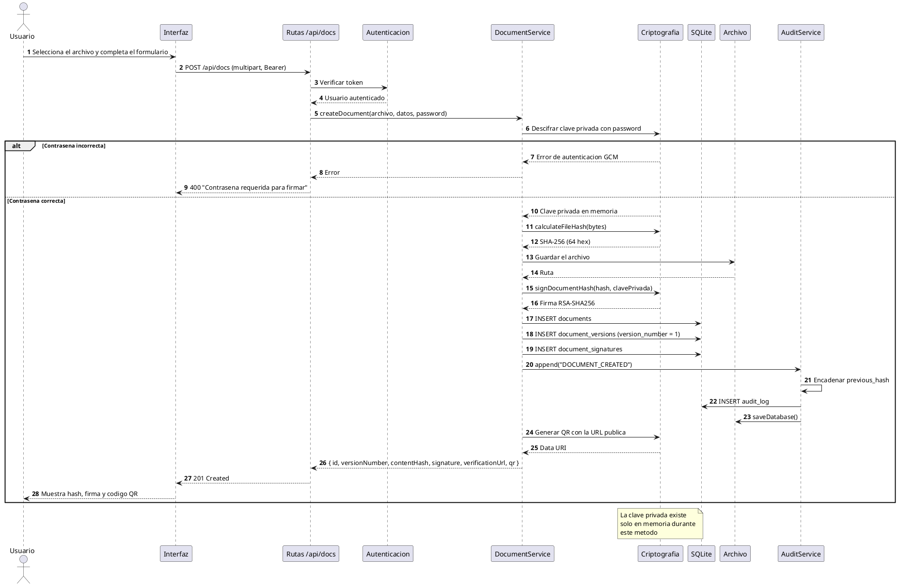
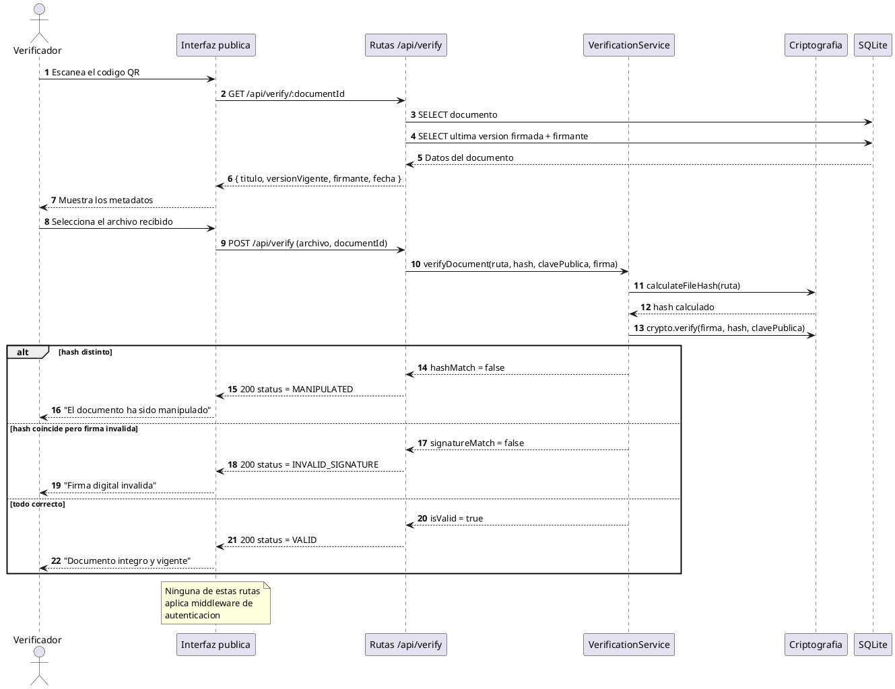
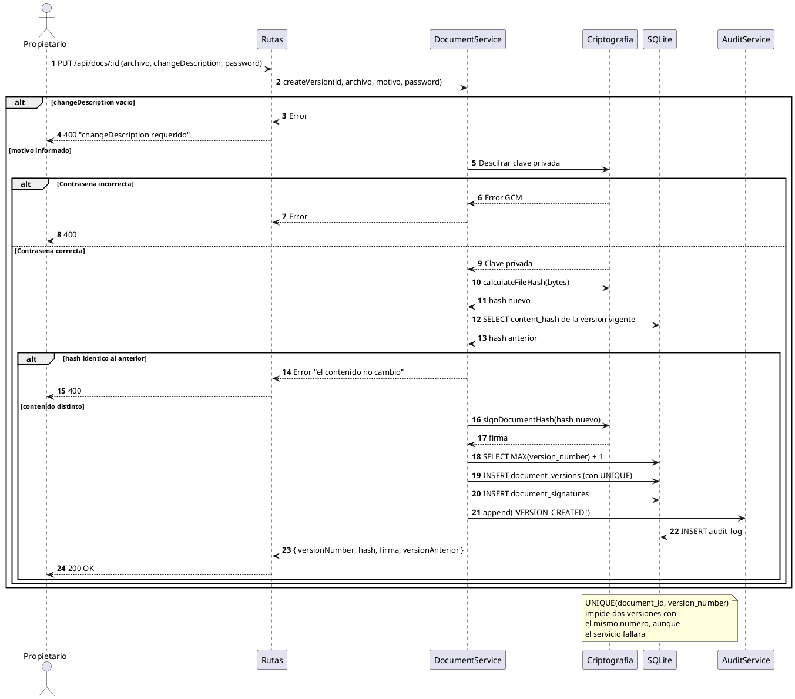
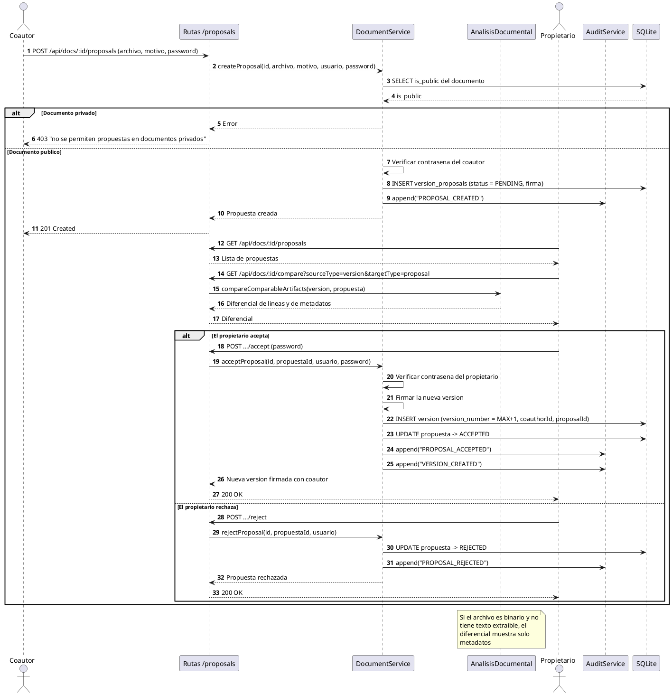
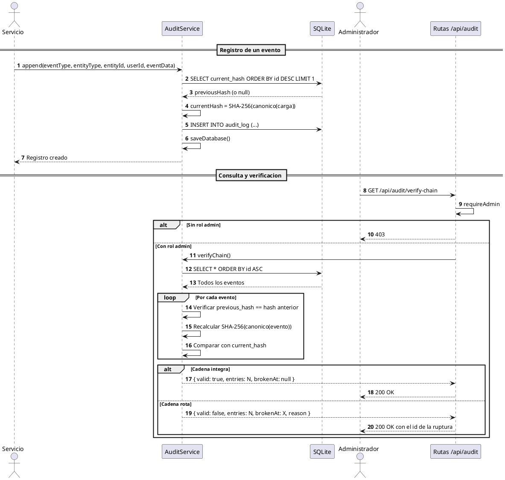

# Diagramas de Secuencia — SGD-FD

**Proyecto:** Sistema de Gestión Documental con Firma Digital y Trazabilidad
**Tipo:** Diagrama de secuencia (UML 2.5)
**Notación:** PlantUML

---

## 1. Propósito

Mostrar la interacción ordenada entre participantes durante la ejecución de
los flujos principales del SGD-FD, con los mensajes concretos que intercambian.

Se documentan cinco secuencias: emisión, verificación pública, versionado,
coautoría y auditoría.

---

## 2. Secuencia 1 · Emisión de un documento firmado

### 2.1. Mensajes y su propósito

| # | Emisor → Receptor | Mensaje | Propósito |
|:-:|-------------------|---------|-----------|
| 1 | Usuario → Interfaz | Seleccionar archivo | Capturar la entrada |
| 2 | Interfaz → Rutas | `POST /api/docs` | Solicitar emisión |
| 3 | Rutas → Autenticación | Verificar token | Identificar al usuario |
| 4 | Rutas → Servicio | `createDocument` | Delegar la lógica |
| 5 | Servicio → Criptografía | Descifrar clave privada | Obtener la clave con la contraseña |
| 6 | Servicio → Criptografía | `calculateFileHash` | Obtener el hash del contenido |
| 7 | Servicio → Archivo | Guardar | Persistir el archivo |
| 8 | Servicio → Criptografía | `signDocumentHash` | Firmar el hash |
| 9 | Servicio → Base de datos | 3 `INSERT` | Registrar documento, versión y firma |
| 10 | Servicio → Auditoría | `append` | Dejar constancia |
| 11 | Servicio → Criptografía | Generar QR | Producir el código de verificación |
| 12 | Servicio → Interfaz | Respuesta 201 | Informar el resultado |

---

## 3. Secuencia 2 · Verificación pública sin cuenta

### 3.1. Decisión central

La separación entre `MANIPULATED` e `INVALID_SIGNATURE` es deliberada:

| Estado | Significado | Causa |
|--------|-------------|-------|
| `MANIPULATED` | El contenido cambió | El hash no coincide |
| `INVALID_SIGNATURE` | La firma no corresponde | La clave pública no valida la firma |
| `VALID` | Ambos coinciden | Documento íntegro y firmado |

Confundirlos impediría al verificador saber si el problema está en el archivo o
en la firma.

---

## 4. Secuencia 3 · Creación de una nueva versión

---

## 5. Secuencia 4 · Coautoría: propuesta y aceptación

---

## 6. Secuencia 5 · Auditoría y verificación de la cadena

### 6.1. Detección de manipulación

Si alguien modifica `event_data` de la fila con `id = 57` sin recalcular los
hashes, la verificación falla en dos puntos posibles:

| Alteración | Cómo se detecta |
|------------|-----------------|
| Se cambia el contenido de un evento | `current_hash` recalculado no coincide |
| Se elimina una fila | `previous_hash` de la siguiente no coincide |
| Se inserta una fila falsa | `previous_hash` no apunta al evento anterior |
| Se reordena la tabla | `previous_hash` deja de seguir la secuencia |

En los cuatro casos, `brokenAt` identifica el `id` exacto de la ruptura.

---

## 7. Resumen de las Secuencias

| Secuencia | Actores externos | Mensajes | Alternativas | Resultado clave |
|-----------|:----------------:|:--------:|:------------:|-----------------|
| 1. Emisión | 1 (usuario) | 12 | 2 | Documento firmado con QR |
| 2. Verificación | 1 (verificador) | 9 | 3 | Veredicto sobre la integridad |
| 3. Versionado | 1 (propietario) | 13 | 4 | Nueva versión correlativa |
| 4. Coautoría | 2 (coautor, propietario) | 20 | 3 | Versión con coautor registrado |
| 5. Auditoría | 2 (servicio, admin) | 14 | 2 | Cadena verificada o punto de ruptura |

---

## 8. Referencias Cruzadas

- [`diagrama_casos_uso.md`](diagrama_casos_uso.md) — Casos de uso
- [`diagrama_actividades.md`](diagrama_actividades.md) — Diagrama de actividades
- [`diagrama_estados.md`](diagrama_estados.md) — Máquina de estados
- [`../02_diseno_construccion/procesos_empresa/to_be/proceso_to_be_03.md`](../02_diseno_construccion/procesos_empresa/to_be/proceso_to_be_03.md) — Proceso TO-BE de verificación
